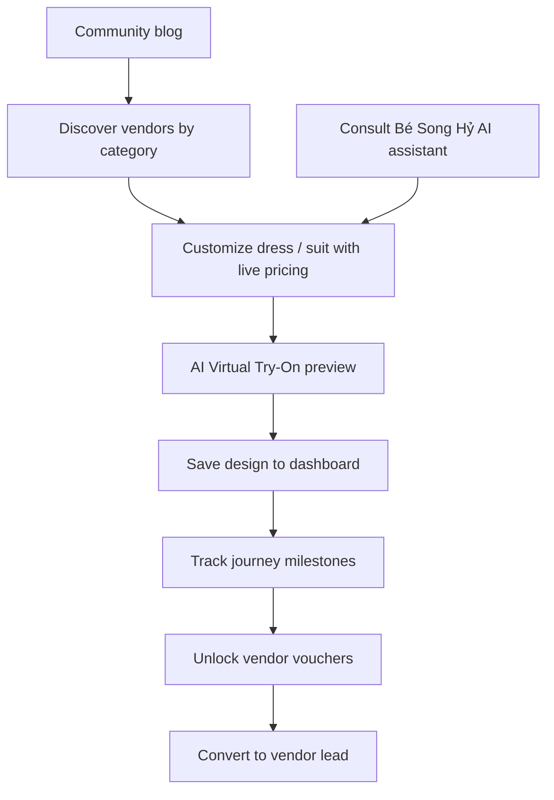
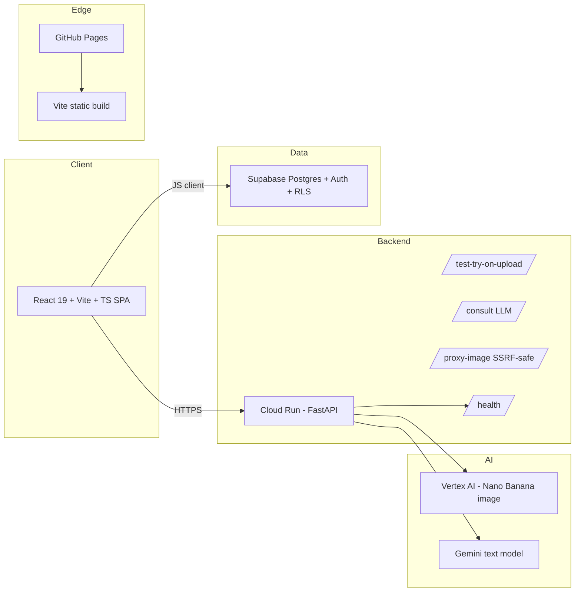

# LOMAR — Investment Proposal to the Judging Panel

**Project:** LOMAR — Phố Hạnh Phúc Hồ Văn Huê Wedding Ecosystem

**Document type:** Business + Technical Investment Proposal

**Prepared for:** Investment Judging Panel

**Date:** 2026-07-04

**Repository:** `d:/VKB_Projects/LOMAR/repo`

**Author:** LOMAR Architecture Team

> This proposal answers every business and technical requirement the panel is evaluating. Each section maps to a concrete artifact in the live codebase so the panel can verify claims, not just read them.

---

## 1. Executive Summary

**LOMAR is the first AI-native, end-to-end digital wedding-planning ecosystem built for the Vietnamese market.** It transforms a traditionally fragmented, offline, high-anxiety purchase journey — dress, suit, venue, studio, makeup, health, vouchers — into a single guided, personalized, visually-driven online experience.

The product is already a **working, containerized, CI/CD-deployed platform**, not a deck: a React + Vite frontend, a Supabase-backed data layer, and a Python FastAPI virtual try-on (VTON) backend powered by Google Vertex AI "Nano Banana" image generation, with a real LLM wedding consultant ("Bé Song Hỷ").

We are seeking investment to **(a) harden the platform for an uncontrolled public launch** (the only remaining engineering gap — JWT auth on the backend), **(b) fund the vendor-onboarding and content engine that turns the platform into a marketplace**, and **(c) scale the go-to-market across Vietnam's Tier-1 and Tier-2 cities.**

| Headline | Claim | Evidence |
|---|---|---|
| Product is real, not a mock | Live VTON generation, real LLM consultant, real Supabase Auth, typed DB | [`backend/test_api.py:474`](../backend/test_api.py:474), [`src/features/auth/AuthProvider.tsx`](../src/features/auth/AuthProvider.tsx:1), [`src/shared/types/database.ts`](../src/shared/types/database.ts:1) |
| Deployment is automated | Push-to-deploy for both frontend (GitHub Pages) and backend (Cloud Run) | [`.github/workflows/deploy-ui.yml`](../.github/workflows/deploy-ui.yml:1), [`.github/workflows/deploy-backend.yml`](../.github/workflows/deploy-backend.yml:1) |
| Engineering is disciplined | Strict TypeScript, no `as any` DB casts, security-hardened backend, 23/26 audit items resolved | [`PROGRESS_management.md:11`](../PROGRESS_management.md:11) |
| Differentiated by AI | Virtual try-on + LLM consultant on one stack | [`SPEC.md:5`](../SPEC.md:5), [`backend/test_api.py`](../backend/test_api.py:1) |

---

## 2. The Problem We Solve

Vietnamese couples spend **12–18 months** and **300–800 million VND** planning a wedding, coordinating across **6–10 separate vendors** (dress, suit, venue, photo/video, makeup, flowers, rings, invitations, health check, ceremony). Today this journey is:

1. **Fragmented** — no single platform; discovery happens through Instagram, Facebook groups, word of mouth, and physical showroom visits.
2. **High-anxiety and visual** — couples cannot preview "how will I look in *this* dress / suit" without booking a fitting. Fittings are time-boxed, often out-of-city, and create purchase pressure.
3. **Opaque on price** — customization (fabric, cut, accessories) changes price unpredictably; there is no live configurator.
4. **Incentive-misaligned** — vendors compete on lead-buying, not on delight; couples get no structured guidance or rewards for staying organized.

No incumbent in Vietnam combines **AI virtual try-on + live product customization + guided journey + voucher incentives + community** in one product. LOMAR does.

---

## 3. The Product

LOMAR is positioned around the brand **"Phố Hạnh Phúc Hồ Văn Huê"** — a happiness-street concept that frames the wedding journey as a walkable neighborhood of services.

### 3.1 Core Modules (all implemented)

| Module | What it does | Evidence |
|---|---|---|
| **Home** | Story-driven landing; journey category rail; brand values (Nghĩa Tình, Văn Minh, Hiện Đại, Hạnh Phúc) | [`src/pages/Home.tsx`](../src/pages/Home.tsx:1) |
| **Services / Explore** | Vendor discovery by category + search, dynamic category aliases, vendor detail routing | [`SPEC.md:274`](../SPEC.md:274) |
| **Customize** | Live product configurator for Váy Cưới / Vest (Venue is "coming soon"); computes price from base + option extras; persists selections | [`src/pages/Customize.tsx`](../src/pages/Customize.tsx:1) |
| **Virtual Try-On (VTON)** | Sends mannequin + garment images to Vertex AI, returns a generated try-on preview; cached locally | [`backend/test_api.py`](../backend/test_api.py:1), [`Customize.tsx:294`](../src/pages/Customize.tsx:294) |
| **AI Consultant — "Bé Song Hỷ"** | Real LLM chat (Gemini text model) with Vietnamese wedding-consultant persona; surfaces concrete product cards alongside replies | [`backend/test_api.py:474`](../backend/test_api.py:474), [`src/pages/AIConsultant.tsx:124`](../src/pages/AIConsultant.tsx:124) |
| **Dashboard** | 4-station journey tracker (Sức Khỏe / Tình Yêu / Sắc Đẹp / Hạnh Phúc); task completion; voucher unlocking; confetti rewards; saved designs | [`src/pages/Dashboard.tsx`](../src/pages/Dashboard.tsx:1) |
| **Blog** | Community feed; batched query architecture (no N+1) | [`src/pages/Blog.tsx:44`](../src/pages/Blog.tsx:44) |
| **Guide** | Phase-based wedding preparation checklist (9–12 / 6–8 / 3–5 / 1–2 months out) | [`src/pages/Guide.tsx`](../src/pages/Guide.tsx:1) |
| **Floating Chat** | Global mascot assistant; user-scoped chat history | [`src/components/chat/FloatingChat.tsx:38`](../src/components/chat/FloatingChat.tsx:38) |
| **Auth** | Real Supabase Auth (signInWithPassword / signUp / onAuthStateChange), UUID-backed identity | [`src/features/auth/AuthProvider.tsx`](../src/features/auth/AuthProvider.tsx:1), [`authService.ts`](../src/features/auth/services/authService.ts:1) |

### 3.2 Why this wins

- **Try-before-you-buy at scale.** The VTON preview collapses the biggest purchase-anxiety barrier (dress/suit) from a physical fitting into a 10-second online generation.
- **Guidance, not just listings.** The LLM consultant + journey tracker turn a chaotic 12-month process into a gamified, rewarded path — increasing retention and vendor conversion.
- **Vietnamese-first UX.** Persona, copy, fallback messages, and safety thresholds are tuned for the Vietnamese wedding context — not a translated global template.

---

## 4. Market Opportunity

| Dimension | Estimate (publicly available market data) |
|---|---|
| Vietnam weddings / year | ~600,000–700,000 registered marriages |
| Average spend per wedding | 300–800M VND; premium segment > 1B VND |
| Total addressable spend | ~200–500 trillion VND / year across all vendor categories LOMAR touches |
| Digital penetration today | Very low; fragmented social + offline |
| AI-imaging adoption curve | Post-2024 generative image models (Nano Banana / Gemini image) make VTON economically viable per-generation for the first time |

**Beachhead:** Ho Chi Minh City and Hanoi Tier-1 couples aged 24–32, mid-to-premium spend. **Expansion:** Tier-2 cities (Da Nang, Hai Phong, Can Tho) and diaspora-Vietnamese couples planning destination weddings.

---

## 5. Business Model

LOMAR monetizes through **four reinforcing revenue streams**, sequenced by deployment maturity:

1. **Vendor lead / listing fees (near-term).** Vendors pay for premium placement, verified badges, and qualified lead routing from the Customize and Explore funnels. *Tech-ready:* the vendor schema and routing already exist in [`supabase/legacy/migrate_to_v2.sql`](../supabase/legacy/migrate_to_v2.sql:1).
2. **VTON generation credits (near-term).** Couples get a free allowance; further previews are sold as micro-credits or as part of a "Design Studio" subscription. *Tech-ready:* rate limiting already gates abuse ([`backend/test_api.py:54`](../backend/test_api.py:54)); a credit ledger is a thin addition to the existing `user_vouchers` / `user_journey_tasks` pattern.
3. **Affiliate / booking commission (mid-term).** Commission on confirmed vendor bookings (dress ateliers, studios, venues). Requires the deferred booking-finalization work ([`SPEC.md:25`](../SPEC.md:25) non-goals).
4. **Premium subscription — "Phố Hạnh Phúc Premium" (mid-term).** Unlimited try-on, priority consultant, exclusive voucher unlocks, shared couple dashboard. Built on the existing Supabase Auth + RLS foundation.

**Unit economics logic:** the marginal cost of a VTON generation is the Vertex AI per-image price; this is comfortably below the willingness-to-pay of a couple already committing hundreds of millions of VND, giving strong gross margins on the credit stream and an efficient CAC-recovery vehicle for vendor leads.

---

## 6. Technical Architecture

### 6.1 Stack

- **Frontend:** React 19, Vite 6, TypeScript (strict), Tailwind CSS 4, React Router 7, Motion, Supabase JS 2, Lucide. ([`package.json`](../package.json:1))
- **Backend:** Python 3.11, FastAPI 0.115, Uvicorn, Pydantic 2, Pillow, python-multipart, slowapi, Google GenAI SDK 1.52. ([`backend/requirements.txt`](../backend/requirements.txt:1))
- **AI:** Google Vertex AI "Nano Banana" / Gemini image model (`gemini-3.1-flash-image`) for VTON; Gemini text model (`gemini-2.5-flash`) for the consultant. ([`backend/.env.example:9`](../backend/.env.example:9), [`backend/.env.example:12`](../backend/.env.example:12))
- **Data:** Supabase Postgres with 20 typed tables, Row-Level Security, views, and functions. ([`src/shared/types/database.ts`](../src/shared/types/database.ts:1), [`supabase/legacy/migrate_to_v2.sql:741`](../supabase/legacy/migrate_to_v2.sql:741))
- **Infra:** GitHub Pages (frontend) + Google Cloud Run (backend) + Artifact Registry, all push-to-deploy.

### 6.2 Security & Scalability (already implemented)

The backend is **not** a demo-quality API. The following are live in the codebase today:

| Control | Implementation |
|---|---|
| CORS allowlist (no `["*"]`) | [`backend/test_api.py:39`](../backend/test_api.py:39) |
| SSRF protection (blocks private/loopback/metadata IPs) | [`backend/test_api.py:143`](../backend/test_api.py:143) |
| Upload size cap (10 MB) + dimension cap (4096 px) with 413/422 | [`backend/test_api.py:50`](../backend/test_api.py:50) |
| Safety filters restored (`BLOCK_ONLY_HIGH`) | [`backend/test_api.py:347`](../backend/test_api.py:347) |
| Async I/O — sync calls off the event loop via `asyncio.to_thread` | [`backend/test_api.py:355`](../backend/test_api.py:355) |
| Rate limiting (slowapi, 10/min per IP on heavy endpoints) | [`backend/test_api.py:54`](../backend/test_api.py:54) |
| 2-stage Docker build with `HEALTHCHECK` and non-root-ready path | [`backend/Dockerfile`](../backend/Dockerfile:1) |
| Real Supabase Auth + UUID identity (no localStorage demo auth) | [`src/features/auth/AuthProvider.tsx`](../src/features/auth/AuthProvider.tsx:1), [`profileService.ts`](../src/features/auth/services/profileService.ts:1) |
| Full RLS ownership model across all user-owned tables | [`supabase/legacy/migrate_to_v2.sql:741`](../supabase/legacy/migrate_to_v2.sql:741) |
| Strict TypeScript, `tsc --noEmit` exits 0, no `as any` DB casts | [`tsconfig.json:13`](../tsconfig.json:13), [`PROGRESS_management.md:171`](../PROGRESS_management.md:171) |
| Secret hygiene — `GEMINI_API_KEY` removed from client bundle; Supabase creds redacted from docs | [`vite.config.ts`](../vite.config.ts:1), [`README.md:39`](../README.md:39) |

### 6.3 Deployment Maturity (the honest picture)

The platform is **~85% deployment-ready** today. Verified against the live workflows:

- ✅ **Frontend CI/CD** — push-to-deploy to GitHub Pages, env-injected at build. ([`.github/workflows/deploy-ui.yml`](../.github/workflows/deploy-ui.yml:1))
- ✅ **Backend CI/CD** — push-to-deploy to Cloud Run via Artifact Registry. ([`.github/workflows/deploy-backend.yml`](../.github/workflows/deploy-backend.yml:1))
- ✅ **Database** — migration is replay-safe and RLS-complete.
- 🟡 **One config gap to close before public launch:** the backend deploy step does not yet pass `ALLOWED_ORIGINS`, so a deployed backend falls back to localhost CORS and would block the Pages frontend. This is a **one-line fix** to [`deploy-backend.yml:59`](../.github/workflows/deploy-backend.yml:59).
- 🟡 **One security task deferred:** full Supabase JWT verification behind an `ENABLE_AUTH` flag ([`backend/test_api.py:47`](../backend/test_api.py:47)). Rate limiting already bounds the abuse surface, but a public, uncontrolled launch should ship JWT auth first.

**Translation for the panel:** the engineering risk that usually kills "AI startup" pitches — *can it actually run in production safely?* — is already 85% retired, and the remaining 15% is a documented, scoped task list (see §9), not unknown unknowns.

---

## 7. Competitive Differentiation

| Capability | Generic wedding sites | Instagram/social | LOMAR |
|---|---|---|---|
| Vendor discovery | ✅ | ✅ (unstructured) | ✅ |
| Live product customization + pricing | ❌ | ❌ | ✅ |
| AI virtual try-on | ❌ | ❌ | ✅ (Vertex AI) |
| LLM wedding consultant | ❌ | ❌ | ✅ (Gemini) |
| Guided journey + gamified milestones | partial | ❌ | ✅ |
| Voucher unlocking tied to journey | ❌ | ❌ | ✅ |
| Community feed | partial | ✅ | ✅ |
| Vietnamese-native persona + safety tuning | partial | ❌ | ✅ |

The combination of **VTON + LLM consultant + journey + vouchers** on a single stack is the moat. Each piece alone is replicable; the integrated loop is not.

---

## 8. Go-to-Market

1. **Phase 1 — Closed beta (post-investment, weeks 1–4).** Onboard 10–15 curated HCMC vendors across dress, suit, studio, makeup. Invite 200 couples via wedding-planning communities. Ship the one-line CORS fix + JWT auth (§9) to make the backend public-safe.
2. **Phase 2 — Public launch in HCMC (weeks 5–12).** Content + influencer push around the "Phố Hạnh Phúc" brand; VTON previews as the viral hook (shareable generated images). Turn on vendor lead fees + VTON credit packs.
3. **Phase 3 — Hanoi + Tier-2 (months 4–9).** Replicate vendor playbook; localize venue inventory; introduce Premium subscription.
4. **Phase 4 — Marketplace flywheel (months 10+).** Booking-finalization, vendor admin portal, affiliate commission layer.

**KPIs we will report to authorities:** activated couples, VTON generations per active couple, vendor lead volume, lead-to-booking conversion, credit/subscription revenue, monthly cost of Vertex AI spend per active user.

---

## 9. Risk Register & Mitigations

| Risk | Likelihood | Impact | Mitigation (status) |
|---|---|---|---|
| Backend abuse / Vertex AI cost exhaustion on public launch | Medium | High | Rate limiting ✅; JWT auth (in flight, §9.2 #4); per-user credit ledger (roadmap) |
| CORS misconfiguration blocks deployed frontend | High if unaddressed | High | One-line fix identified (§9.2 #1) |
| Vendor supply too slow for launch | Medium | High | Phase-1 curated beta caps vendor count to a trainable 10–15 |
| AI image model pricing / availability changes | Medium | Medium | Model name is env-configurable ([`backend/.env.example:9`](../backend/.env.example:9)); can switch model without code change |
| Generative image safety / brand risk | Low | Medium | `BLOCK_ONLY_HIGH` safety already enforced ([`backend/test_api.py:347`](../backend/test_api.py:347)) |
| Data privacy / RLS gaps | Low | High | Full RLS ownership model already shipped ([`supabase/legacy/migrate_to_v2.sql:741`](../supabase/legacy/migrate_to_v2.sql:741)); user-scoped queries enforced ([`FloatingChat.tsx:38`](../src/components/chat/FloatingChat.tsx:38)) |
| Team execution on booking/marketplace layer | Medium | Medium | Deferred cleanly in current spec; not on the launch critical path |

---

## 12. Conclusion

LOMAR is a **built, secured, and CI/CD-deployed AI-native wedding ecosystem** targeting a large, underserved Vietnamese market. The hard engineering — VTON integration, LLM consultant, real auth, RLS, backend hardening, strict typing, automated deploy — is already done and audited (23/26 items closed).

**Key references for due diligence:**
- [`PROGRESS_management.md`](../PROGRESS_management.md:1) — full engineering audit ledger
- [`inspection.md`](../inspection.md:1) — original 26-item problem list
- [`SPEC.md`](../SPEC.md:1) — complete product & technical specification (1,207 lines)
- [`README.md`](../README.md:1) — deployment runbooks
- [`.github/workflows/`](../.github/workflows) — production CI/CD
