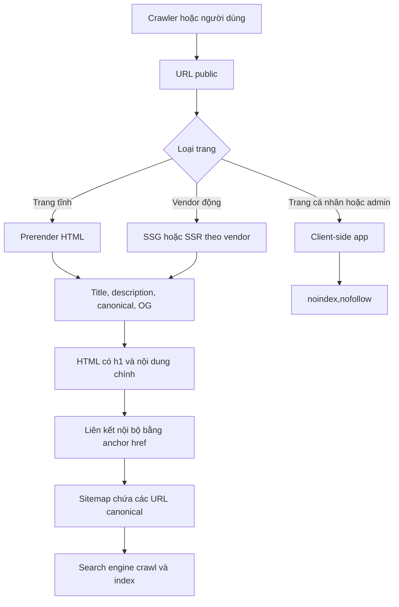

# LOMAR — Báo cáo đánh giá Semantic HTML và SEO

**Dự án:** LOMAR — Hệ sinh thái cưới Phố Hạnh Phúc Hồ Văn Huê

**Loại tài liệu:** Báo cáo audit mã nguồn

**Ngày:** 2026-07-30

**Phạm vi:** Các route công khai, layout dùng chung, metadata, khả năng crawl/index, routing khi triển khai GitHub Pages và hiệu năng build liên quan đến SEO

**Phương pháp:** Đọc mã nguồn tĩnh, kiểm tra output production và chạy `npm run build`

---

## 1. Tóm tắt điều hành

Codebase hiện tại **chưa đáp ứng SEO ở mức sẵn sàng cho production**.

Ứng dụng đã có một số nền tảng Semantic HTML tốt như `nav`, `main`, `footer`, heading chính trên các landing page và thuộc tính `alt` cho phần lớn ảnh nội dung. Tuy nhiên, các ưu điểm này chưa bù được những hạn chế lớn về technical SEO: toàn bộ route dùng chung metadata, HTML production ban đầu không chứa nội dung, không có prerender/SSR, thiếu sitemap và structured data, một số URL quan trọng không được thể hiện bằng liên kết có `href`, và deep link có nguy cơ trả về 404 khi triển khai trên GitHub Pages.

Điểm đánh giá tổng quan:

| Hạng mục | Điểm | Nhận định |
|---|---:|---|
| Semantic HTML | 5/10 | Có landmark cơ bản nhưng cấu trúc tài liệu chưa nhất quán |
| Technical và on-page SEO | 3/10 | Thiếu metadata theo route, canonical, sitemap và structured data |
| Khả năng index nội dung động | 2/10 | Nội dung chỉ xuất hiện sau khi JavaScript chạy |
| Khả năng khám phá liên kết | 4/10 | Điều hướng chính tốt, nhưng vendor card không phải liên kết thật |
| Hiệu năng liên quan SEO | 5/10 | Build thành công nhưng bundle đầu vào và ảnh còn lớn |

Các phát hiện chính:

| ID | Mức độ | Phát hiện | Ảnh hưởng chính |
|---|---|---|---|
| SEO-01 | Nghiêm trọng | HTML production ban đầu không có nội dung trang | Bot không chạy JavaScript không thể đọc nội dung |
| SEO-02 | Cao | Mọi route dùng chung một title và thiếu toàn bộ metadata SEO quan trọng | Kết quả tìm kiếm và link preview không mô tả đúng từng trang |
| SEO-03 | Cao | `BrowserRouter` trên GitHub Pages không có fallback cho deep link | Route con có thể trả HTTP 404 khi mở trực tiếp hoặc refresh |
| SEO-04 | Cao | Vendor card điều hướng bằng `onClick`, không có anchor `href` | Crawler khó phát hiện các URL chi tiết vendor |
| SEO-05 | Trung bình | Blog không có `h1`, không dùng `article` và không có URL riêng cho bài viết | Bài viết không tạo thành tài liệu có khả năng xếp hạng độc lập |
| SEO-06 | Trung bình | Có landmark `main` lồng nhau | Cấu trúc tài liệu và hỗ trợ công nghệ trợ năng không hợp lệ |
| SEO-07 | Trung bình | Không có sitemap, robots, canonical hoặc JSON-LD | Khó kiểm soát crawl, URL chuẩn và rich results |
| SEO-08 | Trung bình | Các route cá nhân/quản trị chưa có `noindex` | Có nguy cơ index các trang không mang giá trị tìm kiếm |
| SEO-09 | Thấp | Khai báo ngôn ngữ là tiếng Anh cho website tiếng Việt | Công cụ tìm kiếm và trình đọc màn hình nhận sai ngôn ngữ |
| SEO-10 | Trung bình | Bundle JavaScript và một số ảnh production còn lớn | Có thể làm giảm tốc độ render, LCP và trải nghiệm crawl |

---

## 2. Phạm vi và nguồn kiểm tra

Các thành phần chính được kiểm tra:

| Thành phần | Vai trò |
|---|---|
| [`index.html`](../../../index.html) | HTML shell và metadata mặc định |
| [`src/app/router.tsx`](../../../src/app/router.tsx) | Danh sách route và cơ chế router |
| [`src/shared/layout/Layout.tsx`](../../../src/shared/layout/Layout.tsx) | Landmark chính của các trang public |
| [`src/shared/layout/Navbar.tsx`](../../../src/shared/layout/Navbar.tsx) | Điều hướng nội bộ |
| [`src/shared/layout/Footer.tsx`](../../../src/shared/layout/Footer.tsx) | Footer, liên kết nhanh và thông tin liên hệ |
| [`src/features/home/HomePage.tsx`](../../../src/features/home/HomePage.tsx) | Trang chủ |
| [`src/features/vendors/ServicesPage.tsx`](../../../src/features/vendors/ServicesPage.tsx) | Danh sách vendor/dịch vụ |
| [`src/features/vendors/VendorDetailPage.tsx`](../../../src/features/vendors/VendorDetailPage.tsx) | Trang chi tiết vendor |
| [`src/features/vendors/components/VendorCard.tsx`](../../../src/features/vendors/components/VendorCard.tsx) | Cơ chế mở URL chi tiết vendor |
| [`src/features/blog/BlogPage.tsx`](../../../src/features/blog/BlogPage.tsx) | Cấu trúc semantic của feed bài viết |
| [`src/features/guide/GuidePage.tsx`](../../../src/features/guide/GuidePage.tsx) | Landing page cẩm nang |
| [`src/features/customize/CustomizePage.tsx`](../../../src/features/customize/CustomizePage.tsx) | Công cụ tùy chỉnh và landmark nội bộ |
| [`vite.config.ts`](../../../vite.config.ts) | Cấu hình build và base path |
| [`.github/workflows/deploy-ui.yml`](../../../.github/workflows/deploy-ui.yml) | Cơ chế triển khai GitHub Pages |

Báo cáo không kiểm tra URL production thực tế, Google Search Console, Core Web Vitals thực tế hoặc trạng thái index hiện hành. Các kết luận về crawl và routing được suy ra từ mã nguồn và artifact build.

---

## 3. Những điểm đang làm tốt

### 3.1 HTML shell có các khai báo nền tảng

[`index.html`](../../../index.html) đã có:

- `<!doctype html>`;
- `charset="UTF-8"`;
- viewport cho thiết bị di động;
- một title mặc định;
- preconnect tới Google Fonts.

Đây là nền tảng tối thiểu đúng cho một document HTML hiện đại.

### 3.2 Layout dùng landmark cơ bản

Layout public có:

- `nav` trong [`Navbar.tsx:40`](../../../src/shared/layout/Navbar.tsx#L40);
- `main` trong [`Layout.tsx:11`](../../../src/shared/layout/Layout.tsx#L11);
- `footer` trong [`Footer.tsx:23`](../../../src/shared/layout/Footer.tsx#L23).

Các landmark này giúp trình đọc màn hình và crawler nhận diện những vùng chính của trang.

### 3.3 Một số trang có heading chính rõ ràng

Các trang Home, Services, Guide, Vendor Detail và Customize có `h1`, ví dụ:

- [`HeroSection.tsx:26`](../../../src/features/home/components/HeroSection.tsx#L26);
- [`ServicesHero.tsx:20`](../../../src/features/vendors/components/ServicesHero.tsx#L20);
- [`GuidePage.tsx:77`](../../../src/features/guide/GuidePage.tsx#L77);
- [`VendorDetailPage.tsx:56`](../../../src/features/vendors/VendorDetailPage.tsx#L56);
- [`PreviewHeader.tsx:21`](../../../src/features/customize/components/PreviewHeader.tsx#L21).

Các section trên trang chủ cũng sử dụng `section`, `h2` và `h3` tương đối hợp lý.

### 3.4 Phần lớn ảnh nội dung có `alt`

Ảnh vendor sử dụng tên vendor làm `alt`; ảnh dịch vụ sử dụng tên dịch vụ. Cách này tốt hơn các giá trị chung chung và giúp công cụ tìm kiếm hiểu nội dung ảnh.

---

## 4. Phát hiện chi tiết

### SEO-01 — HTML production ban đầu không có nội dung

**Mức độ:** Nghiêm trọng

Artifact production chỉ chứa phần tử mount:

```html
<div id="root"></div>
```

Toàn bộ heading, mô tả, vendor và bài viết chỉ xuất hiện sau khi tải và chạy JavaScript. Dự án không có SSR, SSG hoặc bước prerender route trong cấu hình Vite hiện tại.

Ảnh hưởng:

- Bot không chạy JavaScript không đọc được nội dung.
- Công cụ tạo link preview không nhận metadata hoặc ảnh theo route.
- Việc index dữ liệu lấy từ Supabase phụ thuộc vào khả năng render JavaScript của crawler.
- Nội dung có thể được index chậm hoặc không đầy đủ.

Khuyến nghị:

1. Prerender các route tĩnh như `/`, `/explore`, `/guide` và `/blog`.
2. Sinh trang tĩnh hoặc SSR cho `/vendor/:vendorId`.
3. Nếu SEO là yêu cầu cốt lõi, cân nhắc framework hỗ trợ SSR/SSG thay vì SPA thuần.

### SEO-02 — Thiếu metadata theo route

**Mức độ:** Cao

Toàn bộ ứng dụng chỉ có title mặc định tại [`index.html:6`](../../../index.html#L6). Không tìm thấy:

- `meta name="description"`;
- canonical URL;
- Open Graph;
- Twitter Card;
- robots meta theo route;
- `application/ld+json`;
- logic cập nhật `document.title`.

Do đó `/explore`, `/guide`, `/blog` và `/vendor/:vendorId` dùng chung một title và không có mô tả riêng.

Khuyến nghị:

- Tạo component SEO dùng chung và khai báo title, description, canonical, OG/Twitter theo route.
- Trang vendor phải sinh metadata từ dữ liệu vendor.
- Trang public có metadata `index,follow`; trang cá nhân có `noindex,nofollow`.

### SEO-03 — Deep link trên GitHub Pages có nguy cơ trả 404

**Mức độ:** Cao

Router sử dụng `BrowserRouter` trong [`router.tsx`](../../../src/app/router.tsx), trong khi workflow chỉ upload thư mục `dist` lên GitHub Pages. Build hiện tạo một `index.html` và không tạo `404.html` hoặc HTML riêng cho route.

Các URL sau có thể trả 404 khi mở trực tiếp hoặc refresh:

```text
/<repository>/explore
/<repository>/guide
/<repository>/blog
/<repository>/vendor/:vendorId
```

Điều này ảnh hưởng trực tiếp tới crawl vì crawler truy cập URL độc lập, không nhất thiết đi qua trang chủ.

Khuyến nghị:

- Ưu tiên prerender từng route; hoặc
- triển khai trên hosting hỗ trợ rewrite mọi route về `index.html`; hoặc
- thêm giải pháp fallback tương thích GitHub Pages nếu vẫn duy trì SPA.

Sau khi sửa, mỗi URL public phải trả HTTP 200 khi truy cập trực tiếp.

### SEO-04 — URL vendor không được thể hiện bằng liên kết thật

**Mức độ:** Cao

[`VendorCard.tsx:25`](../../../src/features/vendors/components/VendorCard.tsx#L25) mở trang chi tiết bằng `onClick` trên `motion.div`. Nút “Xem chi tiết” cũng không chứa link hoặc handler riêng. URL chỉ được tạo trong callback `navigate()` từ [`ServicesPage.tsx:26`](../../../src/features/vendors/ServicesPage.tsx#L26).

Crawler thường khám phá URL đáng tin cậy qua:

```html
<a href="/vendor/...">...</a>
```

Khuyến nghị dùng React Router `Link` cho ảnh, tên hoặc toàn bộ card:

```tsx
<Link to={`/vendor/${vendor.id}`}>
  {/* Nội dung card */}
</Link>
```

Thay đổi này cũng cải thiện keyboard navigation và hành vi mở liên kết trong tab mới.

### SEO-05 — Cấu trúc Blog chưa đại diện cho nội dung bài viết

**Mức độ:** Trung bình

Trang Blog có các vấn đề:

- “BLOG” là `h2`, không có `h1` cho trang;
- mỗi post là `div`, không phải `article`;
- post không có heading tiêu đề;
- tên tác giả dùng `h4` dù không phải heading của section;
- không có URL riêng cho từng post;
- ảnh dùng các alt chung chung như `Avatar` và `thumb`.

Vì vậy các post hoạt động như một social feed, không phải các tài liệu có khả năng xếp hạng độc lập.

Khuyến nghị:

```html
<main>
  <h1>Blog cưới</h1>
  <article>
    <header>
      <h2><a href="/blog/...">Tiêu đề bài viết</a></h2>
      <p>Thông tin tác giả và thời gian</p>
    </header>
    <p>Nội dung...</p>
  </article>
</main>
```

Nếu post chỉ là nội dung cộng đồng ngắn và không có tiêu đề/URL riêng, không nên kỳ vọng từng post mang giá trị SEO.

### SEO-06 — Có landmark `main` lồng nhau

**Mức độ:** Trung bình

[`Layout.tsx:11`](../../../src/shared/layout/Layout.tsx#L11) đã bao toàn bộ route public bằng `main`, nhưng:

- Blog tạo thêm `main` tại [`BlogPage.tsx:314`](../../../src/features/blog/BlogPage.tsx#L314);
- Customize tạo thêm `main` tại [`CustomizePage.tsx:132`](../../../src/features/customize/CustomizePage.tsx#L132).

Một document không nên có `main` nằm bên trong `main`. Hai landmark nội bộ này nên đổi thành `section` hoặc `div`, hoặc chuyển trách nhiệm tạo `main` về từng page component thay vì Layout.

### SEO-07 — Thiếu sitemap, robots, canonical và structured data

**Mức độ:** Trung bình

Không tìm thấy:

- `public/robots.txt`;
- `sitemap.xml`;
- canonical URL;
- breadcrumb schema;
- Organization/LocalBusiness schema;
- schema cho vendor hoặc bài viết.

Việc thiếu `robots.txt` không tự động chặn crawler, nhưng thiếu sitemap làm giảm khả năng phát hiện các URL vendor động.

Khuyến nghị:

- Sinh sitemap từ danh sách route public và vendor đang active.
- Khai báo canonical cho mỗi trang.
- Thêm `Organization` hoặc loại local business phù hợp cho thương hiệu chính.
- Thêm `BreadcrumbList` và structured data phù hợp cho trang vendor.
- Chỉ dùng schema phản ánh đúng nội dung hiển thị; không khai báo rating nếu dữ liệu không có nguồn đáng tin cậy.

### SEO-08 — Trang cá nhân và quản trị chưa có `noindex`

**Mức độ:** Trung bình

Các route sau thường không nên xuất hiện trên kết quả tìm kiếm:

- `/login`;
- `/dashboard`;
- `/customize`;
- `/ai-consultant`;
- `/admin/*`.

Hiện không có metadata theo route để đặt `noindex`. Nên thêm:

```html
<meta name="robots" content="noindex,nofollow">
```

Việc chặn index không thay thế cho xác thực và phân quyền; đây chỉ là chỉ thị dành cho công cụ tìm kiếm.

### SEO-09 — Khai báo sai ngôn ngữ tài liệu

**Mức độ:** Thấp

[`index.html:2`](../../../index.html#L2) khai báo:

```html
<html lang="en">
```

Trong khi phần lớn nội dung là tiếng Việt. Nên đổi thành:

```html
<html lang="vi">
```

Nếu một đoạn nội dung sử dụng ngôn ngữ khác đáng kể, có thể khai báo `lang` trực tiếp trên đoạn đó.

### SEO-10 — Bundle và ảnh còn lớn

**Mức độ:** Trung bình

Kết quả `npm run build` tại thời điểm audit:

- Build thành công.
- JavaScript chính: khoảng **898,58 kB**, tương đương **259,86 kB gzip**.
- Vite cảnh báo chunk lớn hơn 500 kB.
- Một số ảnh local trong artifact có kích thước khoảng 300–635 kB.

Nhiều route và tính năng tương tác đang được đưa vào bundle ban đầu. Một số ảnh chưa khai báo `width`, `height` hoặc `loading="lazy"`.

Ảnh hưởng tiềm năng:

- Tăng thời gian tải và parse JavaScript.
- Làm chậm thời điểm nội dung xuất hiện.
- Có thể ảnh hưởng LCP và CLS.
- Crawler cần nhiều tài nguyên hơn để render.

Khuyến nghị:

- Lazy-load các route bằng dynamic import.
- Tách admin, dashboard, AI và customize khỏi bundle public ban đầu.
- Chuyển ảnh sang WebP/AVIF khi phù hợp.
- Khai báo kích thước ảnh để giữ chỗ trước khi tải.
- Dùng `loading="lazy"` cho ảnh dưới màn hình đầu tiên.
- Ưu tiên ảnh hero bằng preload hoặc `fetchpriority="high"` sau khi xác định ảnh LCP thực tế.

---

## 5. Đánh giá Semantic HTML theo trang

| Route | Điểm tốt | Vấn đề chính | Đánh giá |
|---|---|---|---|
| `/` | Có `h1`, nhiều `section`, cấu trúc `h2`/`h3` tương đối tốt | Chỉ render client-side, metadata chung | Khá về semantic, yếu về technical SEO |
| `/explore` | Có `h1`, card có heading và alt theo vendor | Card không phải link, dữ liệu tải client-side | Chưa đạt |
| `/vendor/:id` | Có `h1`, `h2`, nội dung thương hiệu | Thiếu metadata động, canonical, schema và prerender | Chưa đạt |
| `/guide` | Có `h1`, `h2`, `h3`, `aside` | Nhiều khối nội dung vẫn là `div`; metadata chung | Trung bình khá |
| `/blog` | Có `aside` và các nhóm nội dung | Thiếu `h1`, `article`, URL bài viết và heading bài viết | Kém |
| `/customize` | Có heading giao diện | `main` lồng nhau; nội dung công cụ không nên index | Kém về document semantic |
| `/login` | Có `h1` trong panel thương hiệu | Không có `noindex` | Không nên index |
| `/dashboard` | Có `h1` khi đăng nhập | Nội dung cá nhân, không có `noindex` | Không nên index |
| `/ai-consultant` | Cấu trúc giao diện rõ | Không có heading cấp trang và không nên index | Không nên index |
| `/admin/*` | Có shell riêng và `main` riêng | Không có chỉ thị `noindex` | Không nên index |

---

## 6. Kiến trúc SEO mục tiêu



---

## 7. Thứ tự khắc phục đề xuất

### Giai đoạn 1 — Chặn các lỗi nền tảng

1. Đổi `lang="en"` thành `lang="vi"`.
2. Tạo metadata riêng cho từng route.
3. Đặt `noindex` cho login, dashboard, customize, AI Consultant và admin.
4. Chuyển vendor card thành `Link`.
5. Loại bỏ `main` lồng nhau.
6. Đảm bảo mọi deep link public trả HTTP 200 trên môi trường production.

### Giai đoạn 2 — Làm nội dung có thể index

1. Prerender Home, Explore, Guide và Blog.
2. SSG hoặc SSR trang vendor.
3. Tạo sitemap từ dữ liệu vendor active.
4. Thêm canonical, Open Graph và Twitter Card.
5. Thêm JSON-LD phù hợp.

### Giai đoạn 3 — Nâng chất lượng nội dung và hiệu năng

1. Thiết kế URL và trang chi tiết cho bài Blog cần SEO.
2. Dùng `article`, `header`, `time` và heading đúng cấp.
3. Code-split theo route.
4. Tối ưu ảnh và thuộc tính kích thước.
5. Đo Lighthouse và Core Web Vitals trên production.

---

## 8. Tiêu chí nghiệm thu đề xuất

Một phiên bản có thể coi là đạt nền tảng SEO khi thỏa mãn tối thiểu:

- [ ] Mỗi route public trả HTTP 200 khi mở trực tiếp.
- [ ] Source HTML của mỗi route public có title, description, canonical và `h1`.
- [ ] Nội dung chính xuất hiện trong HTML trước khi JavaScript chạy.
- [ ] Mỗi trang chỉ có một landmark `main` chính.
- [ ] Mọi vendor public có URL được liên kết bằng anchor `href`.
- [ ] Sitemap chứa toàn bộ route public canonical và vendor active.
- [ ] `robots.txt` tham chiếu sitemap.
- [ ] Các route cá nhân và admin có `noindex`.
- [ ] Blog dùng cấu trúc semantic phù hợp nếu được định hướng làm nội dung SEO.
- [ ] Không có structured data sai hoặc không khớp nội dung hiển thị.
- [ ] Lighthouse SEO đạt ít nhất 90 trên các trang public đại diện.
- [ ] Không có lỗi canonical, 404 hoặc blocked resource trong Google Search Console.

---

## 9. Kết luận

LOMAR đã có nền tảng Semantic HTML cơ bản nhưng **chưa SEO-ready**. Vấn đề chính không chỉ nằm ở lựa chọn thẻ HTML mà còn ở kiến trúc SPA thuần client, metadata dùng chung, khả năng truy cập trực tiếp route con và việc các URL nội dung động chưa được crawler khám phá một cách rõ ràng.

Ưu tiên cao nhất là làm cho từng route public có HTML và metadata riêng, trả HTTP 200 khi truy cập trực tiếp, đồng thời chuyển các điều hướng nội dung quan trọng thành liên kết có `href`. Sau đó mới nên đầu tư vào structured data, nội dung Blog và tối ưu Core Web Vitals.
