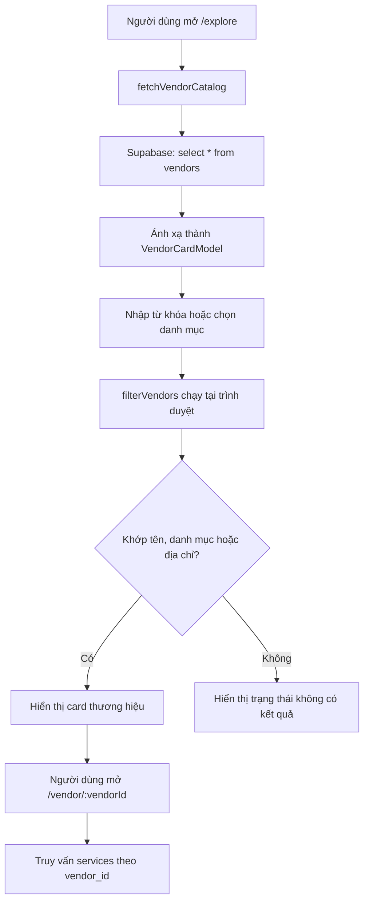

# LOMAR — Báo cáo kiểm tra chức năng tìm kiếm dịch vụ và thương hiệu

**Dự án:** LOMAR — Hệ sinh thái cưới Phố Hạnh Phúc Hồ Văn Huê
**Loại tài liệu:** Báo cáo kiểm tra chức năng
**Ngày:** 2026-07-30
**Phạm vi:** Trang khám phá `/explore`, bộ lọc danh mục, trang chi tiết thương hiệu và cơ chế gợi ý dịch vụ của AI Consultant
**Phương pháp:** Đọc mã nguồn tĩnh, đối chiếu schema/migration và kiểm tra TypeScript

---

## 1. Tóm tắt điều hành

Trang `/explore` hiện thực chất là chức năng **tìm kiếm thương hiệu/nhà cung cấp**, chưa phải tìm kiếm đồng thời cả dịch vụ và thương hiệu như nội dung trên giao diện.

Ứng dụng tải toàn bộ bản ghi có thể đọc được từ bảng `vendors`, chuyển chúng thành card và lọc tại trình duyệt theo tên thương hiệu, danh mục và địa chỉ. Bảng `services` chỉ được truy vấn sau khi người dùng mở trang chi tiết của một thương hiệu. Vì vậy, tên, mô tả, danh mục và giá của dịch vụ không tham gia kết quả tìm kiếm trên `/explore`.

Các phát hiện quan trọng nhất:

| ID | Mức độ | Phát hiện | Ảnh hưởng chính |
|---|---|---|---|
| F-01 | Cao | Ô tìm kiếm không tìm trong bảng `services` | Không tìm được dịch vụ cụ thể dù giao diện tuyên bố hỗ trợ |
| F-02 | Trung bình | Nút “Tìm kiếm” không có hành vi | Trải nghiệm không nhất quán, gây hiểu nhầm |
| F-03 | Trung bình | Không chuẩn hóa dấu tiếng Việt và khoảng trắng | Nhiều từ khóa hợp lệ không trả kết quả |
| F-04 | Trung bình | Tải toàn bộ `vendors` rồi lọc ở client | Khó mở rộng, không có phân trang |
| F-05 | Trung bình | Ứng dụng không tự lọc `status = active` | Phụ thuộc hoàn toàn vào RLS đang được triển khai đúng |
| F-06 | Trung bình | Thiếu kiểm thử tự động cho logic tìm kiếm | Dễ phát sinh hồi quy khi sửa danh mục hoặc chuẩn hóa từ khóa |
| F-07 | Thấp | Danh mục yêu cầu khớp chuỗi tuyệt đối | Dữ liệu không đồng nhất có thể tạo trang kết quả rỗng |
| F-08 | Thấp | Từ khóa không được lưu trên URL | Refresh/chia sẻ URL làm mất trạng thái tìm kiếm |
| F-09 | Thấp | AI Consultant chỉ gợi ý bằng một tập từ khóa cố định | Phạm vi nhận diện dịch vụ rất hẹp và không phải tìm kiếm toàn văn |

Kết quả `npm run lint` tại thời điểm kiểm tra: **đạt**, TypeScript không báo lỗi.

---

## 2. Phạm vi và nguồn kiểm tra

Các thành phần chính được kiểm tra:

| Thành phần | Vai trò |
|---|---|
| [`src/features/vendors/ServicesPage.tsx`](../../../src/features/vendors/ServicesPage.tsx) | Giao diện danh sách kết quả |
| [`src/features/vendors/hooks/useServicesPage.ts`](../../../src/features/vendors/hooks/useServicesPage.ts) | Quản lý dữ liệu, danh mục, từ khóa và trạng thái tải |
| [`src/features/vendors/services/vendorCatalogService.ts`](../../../src/features/vendors/services/vendorCatalogService.ts) | Truy vấn Supabase, ánh xạ và lọc thương hiệu |
| [`src/features/vendors/components/ServicesHero.tsx`](../../../src/features/vendors/components/ServicesHero.tsx) | Ô nhập và nút tìm kiếm |
| [`src/features/vendors/components/CategoryFilterBar.tsx`](../../../src/features/vendors/components/CategoryFilterBar.tsx) | Bộ lọc danh mục |
| [`src/features/vendors/services/vendorDetailService.ts`](../../../src/features/vendors/services/vendorDetailService.ts) | Tải thương hiệu và dịch vụ sau khi mở trang chi tiết |
| [`src/features/ai-consultant/services/serviceSuggestionService.ts`](../../../src/features/ai-consultant/services/serviceSuggestionService.ts) | Suy luận danh mục và gợi ý một dịch vụ |
| [`src/shared/types/database.ts`](../../../src/shared/types/database.ts) | Kiểu dữ liệu `vendors` và `services` |
| [`supabase/legacy/migrate_to_v2.sql`](../../../supabase/legacy/migrate_to_v2.sql) | Chính sách RLS được mô tả cho dữ liệu công khai |

Không thực hiện truy vấn trực tiếp tới database production, vì vậy báo cáo chỉ xác nhận hành vi thể hiện trong codebase; trạng thái RLS thực tế của Supabase cần được kiểm tra riêng trên môi trường triển khai.

---

## 3. Luồng tìm kiếm hiện tại



### 3.1 Tải dữ liệu

Khi hook `useServicesPage` được mount, `fetchVendorCatalog()` được gọi một lần và dữ liệu được lưu trong state `vendors` ([`useServicesPage.ts:27`](../../../src/features/vendors/hooks/useServicesPage.ts#L27)).

Truy vấn hiện tại:

```ts
supabase.from('vendors').select('*')
```

Sau đó mỗi hàng được ánh xạ thành `VendorCardModel`, gồm:

- `id`
- `name`
- `category`
- `rating`
- `address`
- `image`

Tham chiếu: [`vendorCatalogService.ts:40`](../../../src/features/vendors/services/vendorCatalogService.ts#L40).

### 3.2 Lọc từ khóa

`filterVendors()` chuyển từ khóa về chữ thường, sau đó kiểm tra:

```ts
vendor.name.toLowerCase().includes(normalizedSearch)
vendor.category.toLowerCase().includes(normalizedSearch)
vendor.addr?.toLowerCase().includes(normalizedSearch)
```

Điều kiện từ khóa được kết hợp bằng OR; điều kiện danh mục được kết hợp với kết quả từ khóa bằng AND ([`vendorCatalogService.ts:28`](../../../src/features/vendors/services/vendorCatalogService.ts#L28)).

Việc lọc được bọc trong `useMemo` và chạy lại khi `vendors`, `activeCategory` hoặc `searchTerm` thay đổi ([`useServicesPage.ts:51`](../../../src/features/vendors/hooks/useServicesPage.ts#L51)).

### 3.3 Lọc danh mục

Danh mục hiển thị được suy ra từ các thương hiệu đã tải. `Tất Cả` luôn đứng đầu và `Khác`, nếu có, được đẩy xuống cuối ([`vendorCatalogService.ts:22`](../../../src/features/vendors/services/vendorCatalogService.ts#L22)).

Một số danh mục từ URL được ánh xạ sang tên lưu trong database:

| Giá trị đầu vào | Giá trị được ánh xạ |
|---|---|
| `Trang Điểm` | `Make Up` |
| `Chụp Ảnh` | `Studio` |
| `Sức Khỏe` hoặc `Y Tế` | `Sức Khỏe` |
| `Quà Tặng` | `Thiệp Cưới` |

Tham chiếu: [`vendorCatalogService.ts:13`](../../../src/features/vendors/services/vendorCatalogService.ts#L13).

Khi chọn danh mục, hook cập nhật query parameter `category`, nhưng không lưu từ khóa tìm kiếm ([`useServicesPage.ts:56`](../../../src/features/vendors/hooks/useServicesPage.ts#L56)).

### 3.4 Truy vấn dịch vụ

Danh sách `services` không được tải ở trang `/explore`. Chỉ sau khi mở `/vendor/:vendorId`, ứng dụng mới chạy hai truy vấn:

1. Lấy thương hiệu theo `vendors.id`.
2. Lấy tất cả dịch vụ có `services.vendor_id = vendorId`.

Tham chiếu: [`vendorDetailService.ts:9`](../../../src/features/vendors/services/vendorDetailService.ts#L9).

---

## 4. Phát hiện chi tiết

### F-01 — Không tìm kiếm dữ liệu dịch vụ

**Mức độ:** Cao
**Loại:** Sai lệch chức năng/giao diện

Ô nhập sử dụng placeholder “Tìm kiếm dịch vụ, thương hiệu...”, nhưng dữ liệu đầu vào của `filterVendors()` chỉ là `VendorCardModel[]`. Model này không chứa dịch vụ và hàm lọc không truy cập bảng `services`.

Các trường dịch vụ hiện không được tìm:

- `services.name`
- `services.description`
- `services.category`
- `services.base_price`
- Tên thương hiệu liên kết khi kết quả bắt đầu từ một dịch vụ

**Tình huống điển hình:** Một thương hiệu tên “ABC Wedding” có dịch vụ “Chụp ảnh ngoại cảnh”. Tìm “ngoại cảnh” sẽ không trả về thương hiệu này nếu từ khóa không xuất hiện trong tên, danh mục hoặc địa chỉ của thương hiệu.

**Ảnh hưởng:** Người dùng không thể tìm dịch vụ cụ thể theo đúng kỳ vọng do giao diện tạo ra; yêu cầu trong [`SPEC.md:287`](../../../SPEC.md#L287) hiện chỉ khớp với tìm thương hiệu theo tên, danh mục hoặc địa chỉ.

**Khuyến nghị:** Xác định rõ mô hình kết quả mong muốn:

1. Trả về cả card dịch vụ và card thương hiệu; hoặc
2. Trả về thương hiệu nếu bất kỳ dịch vụ trực thuộc nào khớp.

Nên thực hiện tìm kiếm ở Supabase/RPC với quan hệ `services → vendors`, thay vì tải hai bảng đầy đủ về client.

### F-02 — Nút “Tìm kiếm” không có hành vi

**Mức độ:** Trung bình
**Loại:** Usability

Input cập nhật `searchTerm` ngay trong `onChange`, nên danh sách được lọc tức thời. Tuy nhiên nút “Tìm kiếm” không có `onClick`, không nằm trong form có `onSubmit`, và không hỗ trợ phím Enter theo một luồng submit rõ ràng ([`ServicesHero.tsx:25`](../../../src/features/vendors/components/ServicesHero.tsx#L25)).

**Ảnh hưởng:** Người dùng có thể nghĩ thao tác bấm nút không thành công, dù danh sách thực tế đã thay đổi trong lúc nhập.

**Khuyến nghị:** Chọn một trong hai mô hình nhất quán:

- Tìm tức thời: bỏ nút hoặc biến nút thành điều khiển có ý nghĩa khác.
- Tìm khi submit: dùng `<form>`, xử lý `onSubmit`, hỗ trợ Enter và cập nhật URL.

### F-03 — Chuẩn hóa từ khóa chưa đủ cho tiếng Việt

**Mức độ:** Trung bình
**Loại:** Chất lượng kết quả

Code chỉ gọi `toLowerCase()`. Không có:

- `trim()` để loại khoảng trắng đầu/cuối;
- chuẩn hóa Unicode;
- loại dấu tiếng Việt;
- chuẩn hóa nhiều khoảng trắng;
- tokenization hoặc xếp hạng kết quả.

**Ví dụ:**

| Dữ liệu | Từ khóa | Kết quả hiện tại |
|---|---|---|
| `Váy Cưới Bella` | `váy cưới` | Khớp |
| `Váy Cưới Bella` | `vay cuoi` | Không khớp |
| `Bella Bridal` | `  bella  ` | Không khớp |
| `Trang Điểm` | `TRANG ĐIỂM` | Khớp |

**Khuyến nghị:** Dùng một hàm chuẩn hóa chung cho cả dữ liệu và từ khóa, tối thiểu gồm `trim`, `toLocaleLowerCase('vi-VN')`, Unicode normalization và loại dấu.

### F-04 — Tải toàn bộ dữ liệu rồi lọc ở client

**Mức độ:** Trung bình
**Loại:** Hiệu năng/khả năng mở rộng

`fetchVendorCatalog()` gọi `select('*')` mà không có:

- `limit`;
- phân trang;
- lọc danh mục phía server;
- chọn riêng các cột cần thiết;
- tìm kiếm phía database.

**Ảnh hưởng:** Catalog càng lớn thì payload, thời gian tải ban đầu và lượng xử lý tại trình duyệt càng tăng. Mọi người dùng đều phải tải toàn bộ dữ liệu trước khi có thể tìm kiếm.

**Khuyến nghị:**

- Chỉ chọn các cột dùng cho card.
- Phân trang hoặc infinite scroll.
- Đẩy điều kiện category/search xuống Supabase.
- Cân nhắc cột tìm kiếm chuẩn hóa, PostgreSQL full-text search hoặc `pg_trgm` khi cần tìm gần đúng.

### F-05 — Phụ thuộc vào RLS để giới hạn trạng thái công khai

**Mức độ:** Trung bình
**Loại:** Phòng vệ dữ liệu

Query ứng dụng không có:

```ts
.eq('status', 'active')
```

SQL legacy định nghĩa policy cho phép công khai chỉ đọc vendor/service có `status = 'active'` ([`migrate_to_v2.sql:731`](../../../supabase/legacy/migrate_to_v2.sql#L731)). Tuy nhiên các migration đang nằm trong `supabase/migrations` không tạo lại hai policy này.

**Diễn giải:** Nếu RLS và policy đã được triển khai đúng, Supabase sẽ tự loại các bản ghi draft/suspended/archived. Nếu môi trường bị thiếu policy hoặc RLS bị cấu hình sai, frontend không có lớp lọc bổ sung.

**Khuyến nghị:**

1. Xác minh RLS và policy trực tiếp trên từng môi trường.
2. Đưa baseline policy cần thiết vào chuỗi migration đang active hoặc có cơ chế xác minh schema.
3. Bổ sung `.eq('status', 'active')` ở public catalog như một lớp phòng vệ và để ý định truy vấn rõ ràng.

### F-06 — Chưa có kiểm thử tự động cho tìm kiếm

**Mức độ:** Trung bình
**Loại:** Maintainability

Không tìm thấy test cho:

- `filterVendors`;
- `mapExternalCategory`;
- `deriveVendorCategories`;
- từ khóa rỗng;
- tiếng Việt có/không dấu;
- kết hợp từ khóa với danh mục;
- giá trị null/chuỗi rỗng;
- query parameter;
- dịch vụ thuộc thương hiệu.

`package.json` cũng chưa khai báo script test hoặc test runner.

**Khuyến nghị:** Tách hàm chuẩn hóa từ khóa và thêm unit test dạng table-driven cho các trường hợp trên trước hoặc cùng lúc với việc mở rộng tìm kiếm dịch vụ.

### F-07 — Danh mục khớp tuyệt đối và phụ thuộc dữ liệu

**Mức độ:** Thấp
**Loại:** Tính nhất quán dữ liệu

Điều kiện hiện tại:

```ts
activeCategory === 'Tất Cả' || vendor.category === activeCategory
```

Chỉ một số alias được ánh xạ thủ công. Các khác biệt như viết hoa, khoảng trắng, chính tả hoặc tên gần nghĩa sẽ không khớp.

**Ảnh hưởng:** Link từ trang chủ hoặc dữ liệu nhập từ admin có thể dẫn đến trang kết quả rỗng nếu taxonomy không đồng nhất.

**Khuyến nghị:** Dùng mã danh mục ổn định (`slug`/ID) trong database và URL; tên tiếng Việt chỉ dùng để hiển thị.

### F-08 — Từ khóa không được lưu trong URL

**Mức độ:** Thấp
**Loại:** Điều hướng/khả năng chia sẻ

State `searchTerm` chỉ tồn tại trong component. Refresh, mở tab mới hoặc chia sẻ URL sẽ làm mất từ khóa. Khi đổi danh mục, `setSearchParams({ category })` còn thay thế toàn bộ tập query parameter hiện có.

**Khuyến nghị:** Lưu từ khóa bằng tham số `q`, ví dụ:

```text
/explore?category=Studio&q=ngoai+canh
```

Khi cập nhật một tham số, nên giữ lại các tham số hợp lệ còn lại.

### F-09 — Gợi ý dịch vụ của AI Consultant có phạm vi hẹp

**Mức độ:** Thấp
**Loại:** Giới hạn chức năng liên quan

AI Consultant có một đường tìm dịch vụ riêng, nhưng không phải semantic search hoặc full-text search. Code:

1. Dò chuỗi đầu vào theo danh sách từ khóa cố định.
2. Suy ra một trong bốn danh mục: `Váy Cưới`, `Vest`, `Venue`, `Trang Trí`.
3. Truy vấn chính xác `services.category`.
4. Lấy một hàng đầu tiên bằng `.limit(1).single()`.

Tham chiếu: [`serviceSuggestionService.ts:4`](../../../src/features/ai-consultant/services/serviceSuggestionService.ts#L4).

**Điểm hạn chế:**

- Không hỗ trợ nhiều danh mục khác trong schema.
- Không xếp hạng theo độ phù hợp, rating, giá hoặc trạng thái.
- Một từ khóa chung như “cưới” có thể suy ra `Váy Cưới`.
- Không có thứ tự rõ ràng trước khi lấy bản ghi đầu tiên.
- Query không khai báo trực tiếp `status = active`.

**Khuyến nghị:** Dùng chung dịch vụ tìm kiếm/catalog với trang `/explore`, đồng thời cho phép AI truyền category, khoảng giá và từ khóa có cấu trúc.

---

## 5. Khoảng cách giữa giao diện, đặc tả và triển khai

| Kỳ vọng | Giao diện/đặc tả | Triển khai hiện tại | Trạng thái |
|---|---|---|---|
| Tìm thương hiệu theo tên | Có | Có | Đạt |
| Tìm theo danh mục thương hiệu | Có | Có | Đạt, nhưng khớp tuyệt đối |
| Tìm theo địa chỉ | Đặc tả có | Có | Đạt |
| Tìm tên dịch vụ | Placeholder ngụ ý có | Không | Chưa đạt |
| Tìm mô tả dịch vụ | Người dùng có thể kỳ vọng | Không | Chưa đạt |
| Nút tìm kiếm hoạt động | Giao diện ngụ ý có | Không | Chưa đạt |
| Hỗ trợ tiếng Việt không dấu | Hợp lý với người dùng Việt | Không | Chưa đạt |
| Chia sẻ kết quả tìm kiếm | Không nêu rõ | Chỉ lưu category | Một phần |
| Phân trang | Không thể hiện | Không | Chưa có |

---

## 6. Khuyến nghị triển khai theo ưu tiên

### Ưu tiên 1 — Sửa đúng nghĩa tìm kiếm

1. Thống nhất UX: kết quả là dịch vụ, thương hiệu, hay cả hai.
2. Tạo API/repository tìm kiếm có thể truy vấn `services` cùng `vendors`.
3. Cho phép tìm theo `vendor.name`, `vendor.category`, `vendor.address`, `service.name`, `service.category` và `service.description`.
4. Chỉ trả dữ liệu active và các cột cần hiển thị.

### Ưu tiên 2 — Cải thiện chất lượng và trạng thái tìm kiếm

1. Chuẩn hóa từ khóa tiếng Việt.
2. Lưu `q` và `category` trên URL.
3. Làm nút tìm kiếm có hành vi rõ ràng hoặc loại bỏ nút.
4. Dùng category ID/slug thay cho chuỗi hiển thị.

### Ưu tiên 3 — Khả năng mở rộng và độ tin cậy

1. Bổ sung phân trang.
2. Xác minh và quản lý RLS trong chuỗi migration chính thức.
3. Viết unit test cho normalization, alias, category và kết quả kết hợp.
4. Tái sử dụng cùng search service cho AI Consultant.

---

## 7. Bộ kiểm thử tối thiểu được đề xuất

| Nhóm | Trường hợp |
|---|---|
| Từ khóa | Rỗng, chỉ khoảng trắng, chữ hoa/thường, có dấu, không dấu |
| Trường dữ liệu | Tên vendor, địa chỉ, category vendor, tên service, mô tả service, category service |
| Kết hợp | Có từ khóa + tất cả danh mục; có từ khóa + một danh mục |
| Trạng thái | Active được trả về; draft/suspended/archived không được trả về |
| URL | Đọc/ghi `q`, `category`; refresh giữ nguyên kết quả |
| Danh mục | Alias hợp lệ, category không tồn tại, category có khoảng trắng/khác hoa thường |
| Phân trang | Trang đầu, trang cuối, không có kết quả, đổi bộ lọc đặt lại trang |
| Quan hệ | Dịch vụ khớp kéo theo đúng vendor; không lặp vendor ngoài ý muốn |
| Lỗi | Supabase lỗi, timeout, dữ liệu null, vendor không có dịch vụ |
| Accessibility | Submit bằng Enter, label cho input, trạng thái loading/empty được thông báo |

---

## 8. Kết luận

Chức năng hiện tại phù hợp với một catalog thương hiệu nhỏ và lọc tức thời tại client. Tuy nhiên tên gọi và nội dung giao diện đang rộng hơn khả năng thực tế: người dùng chưa thể tìm dịch vụ cụ thể. Việc ưu tiên F-01, F-02 và F-03 sẽ giải quyết phần lớn khoảng cách trải nghiệm; sau đó cần chuyển tìm kiếm sang phía dữ liệu, bổ sung phân trang, chuẩn hóa taxonomy và kiểm thử để hệ thống có thể mở rộng an toàn.
