# LOMAR Deployment Readiness Assessment

Based on [`PROGRESS_management.md`](PROGRESS_management.md:1), the inspection ledger (23/26 items fully resolved, 3 partial), and direct verification of CI/CD, Docker, and env wiring, the project is **~85% ready** for a real deployment — functional and CI/CD-wired, but with a few concrete blockers that should be fixed *before* the first public push.

## Readiness by capability area

```mermaid
flowchart LR
    subgraph Ready
        FE[Frontend Build]
        BE[Backend Build]
        DB[Database / Migrations]
        AUTH[Supabase Auth]
        SECRETS[Secret Hygiene]
    end
    subgraph Partial
        CORS[CORS in Cloud Run]
        JWT[Backend JWT Auth]
        BASE[Base Path Default]
        AUDIT[Git History Audit]
    end
    subgraph ConfigNeeded
        GH[GitHub Secrets / Vars]
        GCP[GCP Credentials]
        SUPA[Supabase Seed Users]
    end
    Ready --> Partial --> ConfigNeeded
```

| Area | Status | Evidence | Gap before real deploy |
|---|---|---|---|
| Frontend CI/CD | ✅ Ready | [`deploy-ui.yml`](.github/workflows/deploy-ui.yml:1) builds Vite, sets `VITE_BASE_PATH` to `/${{ github.event.repository.name }}/`, pushes the artifact → Pages | Need GitHub secrets `VITE_SUPABASE_URL`, `VITE_SUPABASE_ANON_KEY` and a `VTON_BACKEND_URL` variable set in the repo |
| Frontend compile | ✅ Ready | [`tsconfig.json:13`](tsconfig.json:13) `strict: true`; `npx tsc --noEmit` exits 0 ([`PROGRESS_management.md:171`](PROGRESS_management.md:171)) | — |
| Backend container | ✅ Ready | [`Dockerfile`](backend/Dockerfile:1) is a 2-stage build with `HEALTHCHECK` on `/health`, exposes 8080, non-root-ready path | — |
| Backend CI/CD | 🟡 Partial | [`deploy-backend.yml`](.github/workflows/deploy-backend.yml:1) builds → Artifact Registry → Cloud Run, `--port 8080` | **[`deploy-backend.yml:59`](.github/workflows/deploy-backend.yml:59) does not pass `ALLOWED_ORIGINS` in `--set-env-vars`** → deployed backend falls back to localhost-only CORS ([`test_api.py:39`](backend/test_api.py:39)) and will **block the GitHub-Pages frontend** |
| Backend security | 🟡 Partial | CORS allowlist ([`test_api.py:39`](backend/test_api.py:39)), SSRF guard ([`test_api.py:143`](backend/test_api.py:143)), 10 MB / 4096 px limits ([`test_api.py:50`](backend/test_api.py:50)), `BLOCK_ONLY_HIGH` safety ([`test_api.py:347`](backend/test_api.py:347)), slowapi rate limit ([`test_api.py:54`](backend/test_api.py:54)) | Deploys with [`--allow-unauthenticated`](.github/workflows/deploy-backend.yml:57) — anyone can hit the public endpoint. Full Supabase JWT verification is **intentionally deferred** behind the `ENABLE_AUTH` placeholder ([`test_api.py:47`](backend/test_api.py:47), [`PROGRESS_management.md:137`](PROGRESS_management.md:137)) |
| Database / Supabase | ✅ Ready | [`migrate_to_v2.sql`](database/migrate_to_v2.sql:1) is replay-safe (extensions at top, destructive drops neutralized, RLS Section 6b complete). Frontend DB writes are typed, no `as any` ([`PROGRESS_management.md:118`](PROGRESS_management.md:118)) | First deploy assumes the v2 migration has already run on the target Supabase project |
| Auth | 🟡 Partial | Real Supabase Auth wired in [`AppContext.tsx:233`](src/context/AppContext.tsx:233) (`signInWithPassword` / `signUp` / `onAuthStateChange`); UUID-backed identity | Demo accounts depend on **pre-seeded Supabase Auth users with a shared password** ([`PROGRESS_management.md:179`](PROGRESS_management.md:179)). Real signup/seed flow needs verification |
| AI Consultant | ✅ Ready | Real LLM via `POST /consult` backed by `GOOGLE_TEXT_MODEL` ([`test_api.py:474`](backend/test_api.py:474), [`AIConsultant.tsx:124`](src/pages/AIConsultant.tsx:124)) with Vietnamese fallback | — |
| Asset / repo hygiene | 🟡 Partial | No `dist/` or `node_modules/` in tree; `.gitignore` covers both; stray `backend/_ssrf_selftest.py` deleted | One-off `git ls-files` history audit pending ([`PROGRESS_management.md:143`](PROGRESS_management.md:143)) — cosmetic only |
| Routing / base path | 🟡 Partial | [`App.tsx:16`](src/App.tsx:16) `ROUTER_BASENAME = VITE_BASE_PATH || '/LOMAR'`; Vite `base` also configurable | Both default to `/LOMAR`. The CI workflow sets it correctly, so this only bites a manual deploy that forgets the env ([`PROGRESS_management.md:140`](PROGRESS_management.md:140)) |

## Blocking issues for a real deployment

1. **CORS will silently break the deployed frontend** — the highest-impact finding. [`deploy-backend.yml:59`](.github/workflows/deploy-backend.yml:59) sets Vertex AI env vars but omits `ALLOWED_ORIGINS`. With the env unset, [`test_api.py`](backend/test_api.py:39) falls back to `["http://localhost:3000", "http://localhost:5173"]`, so the GitHub Pages frontend cannot call the backend. Fix: add `ALLOWED_ORIGINS=https://<user>.github.io` to the `--set-env-vars` list.
2. **Backend is fully public** — `--allow-unauthenticated` + no JWT verification (Item 16 deferred). Anyone can drive Vertex AI spend, bounded only by slowapi's 10 req/min/IP. Acceptable for a gated preview, risky for a public launch.
3. **GitHub Secrets / repo variables not yet configured** — the workflows reference `secrets.VITE_SUPABASE_URL`, `secrets.VITE_SUPABASE_ANON_KEY`, `secrets.GCP_CREDENTIALS`, and `vars.VTON_BACKEND_URL`. Nothing deploys until these exist.
4. **Supabase seed users / real signup path** — demo sign-in depends on pre-seeded users ([`PROGRESS_management.md:179`](PROGRESS_management.md:179)). A real public launch needs a verified email-signup or seeding run.

## Non-blocking (recommended before launch)

- Set `GOOGLE_TEXT_MODEL` explicitly in the backend deploy env-vars (defaults to `gemini-2.5-flash`, fine).
- Run the deferred [`PROGRESS_management.md:144`](PROGRESS_management.md:144) `git ls-files` history audit (`git ls-files | Select-String -Pattern '^(dist|node_modules)/'`); `git rm --cached` any hits.
- Add `ALLOWED_ORIGINS` and `GOOGLE_TEXT_MODEL` to [`backend/.env.example:38`](backend/.env.example:38) so the prod catalogue is explicit.

## Bottom line
### What's deployment-ready now
- Frontend CI/CD — deploy-ui.yml builds Vite, sets VITE_BASE_PATH correctly, deploys to GitHub Pages. tsconfig.json:13 is strict: true and tsc --noEmit exits 0.
- Backend container — backend/Dockerfile is a 2-stage build with a /health HEALTHCHECK on port 8080.
- Database / Supabase — database/migrate_to_v2.sql is replay-safe with full RLS (Section 6b); frontend DB writes are typed with no as any.
- Auth — real Supabase Auth wired in src/context/AppContext.tsx:233, UUID-backed identity.
- AI Consultant — real LLM via POST /consult backed by GOOGLE_TEXT_MODEL (backend/test_api.py:474).
- Backend hardening — CORS allowlist, SSRF guard, 10 MB / 4096 px limits, BLOCK_ONLY_HIGH safety, slowapi rate limiting all in place.
### Blocking issues before first public push
- CORS will silently break the deployed frontend — deploy-backend.yml:59 omits ALLOWED_ORIGINS from --set-env-vars, so the backend falls back to localhost-only origins (backend/test_api.py:39) and blocks the Pages frontend. Highest-impact fix.
- Backend is fully public — --allow-unauthenticated + JWT auth intentionally deferred behind ENABLE_AUTH (backend/test_api.py:47, PROGRESS_management.md:137). Anyone can drive Vertex AI spend, bounded only by 10 req/min/IP.
- GitHub secrets/vars not yet configured — workflows need secrets.VITE_SUPABASE_URL, secrets.VITE_SUPABASE_ANON_KEY, secrets.GCP_CREDENTIALS, and vars.VTON_BACKEND_URL.
- Supabase seed users — demo sign-in relies on pre-seeded Supabase Auth users (PROGRESS_management.md:179).
### Non-blocking before launch
- Run the deferred PROGRESS_management.md:144 git ls-files history audit for dist//node_modules/.
- Add GOOGLE_TEXT_MODEL to the backend deploy env-vars for an explicit catalogue.