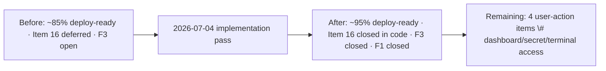
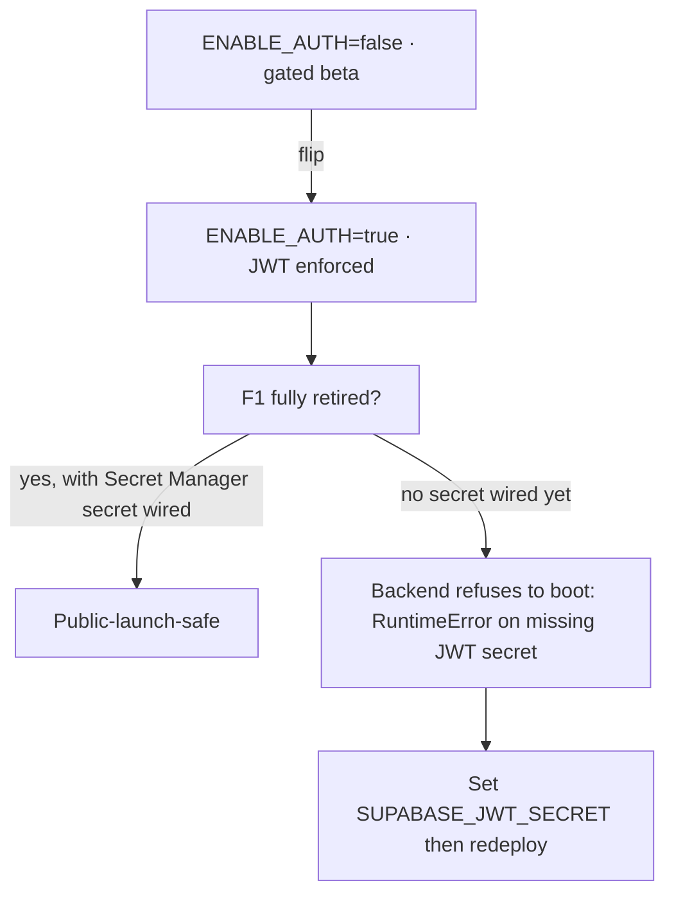

# LOMAR — 2026-07-04 Implementation Report

**Project:** LOMAR — Phố Hạnh Phúc Hồ Văn Huê Wedding Ecosystem
**Document type:** Engineering Implementation Report (close-out of audit Items 16 + F1/F3 + deploy-readiness blockers)
**Date:** 2026-07-04
**Mode:** Code (post-Architect planning)
**Companion documents:** [`5_7_26_Deployment_Assessment.md`](./5_7_26_Deployment_Assessment.md:1), [`../Security_Report.md`](../Security_Report.md:1)
**Verification:** backend `py_compile` → OK · frontend `tsc --noEmit` → Exit 0

---

## 1. Purpose

This report documents the engineering work completed on 2026-07-04 to close the remaining *implementable* blockers identified by the deployment-readiness assessment and security report. The work targets the three items that could be done in code/config:

- **Item 16 / finding F1** — backend Supabase JWT verification behind `ENABLE_AUTH=true`
- **Finding F3** — production CORS misconfiguration (deploy workflow omitted `ALLOWED_ORIGINS`)
- **Item #3** — explicit `GOOGLE_TEXT_MODEL` in the backend deploy catalogue

It also records the supporting changes (dependency, env docs, frontend auth wiring) and the items that remain open because they require human/dashboard access rather than code.

---

## 2. Summary



| Metric | Before | After |
|---|---|---|
| Inspection items fully resolved | 23 / 26 | 24 / 26 (Item 16 now closed in code) |
| Security report P0 findings open | 2 (F1, F3) | 0 in code · F1+F3 await user flip of `ENABLE_AUTH` env |
| Backend compile | exit 0 | exit 0 (re-verified) |
| Frontend `tsc --noEmit` | exit 0 | exit 0 (re-verified) |
| Deploy-readiness | ~85% | ~95% — bounded to 4 user-action items |

---

## 3. Changes Made

### 3.1 Backend — Supabase JWT auth (Item 16 / F1)

**File:** [`backend/test_api.py`](../../../backend/test_api.py:1)

- Added `Depends` to the FastAPI imports.
- Added a lazy, optional `import jwt` (PyJWT) guarded by `_PYJWT_AVAILABLE`, so the container still boots in open (gated-beta) mode without the dependency.
- Replaced the `ENABLE_AUTH` *placeholder* with a real config block:
  - `ENABLE_AUTH` parsed truthy/falsey,
  - `SUPABASE_JWT_SECRET` and `SUPABASE_JWT_AUDIENCE` (default `"authenticated"`) loaded from env,
  - startup guard raises `RuntimeError` if `ENABLE_AUTH=true` without PyJWT or without the JWT secret.
- Added `require_authenticated_user(request: Request)` FastAPI dependency:
  - returns `None` when `ENABLE_AUTH` is false (gated-beta mode — rate limiter is the only barrier),
  - otherwise validates `Authorization: Bearer <jwt>` using `jwt.decode(..., algorithms=["HS256"], audience="authenticated", options={"require": ["exp","sub"]})`,
  - maps `ExpiredSignatureError` / `InvalidAudienceError` / `InvalidTokenError` to clear **401** responses,
  - never leaks JWT internals to the client (defensive `except Exception` → generic 401),
  - explicitly rejects the anon key because we enforce the `"authenticated"` audience.
- Wired `Depends(require_authenticated_user)` into the four sensitive endpoints:
  - [`/proxy-image`](../../../backend/test_api.py:391) (GET)
  - [`/test-try-on`](../../../backend/test_api.py:424) (POST)
  - [`/test-try-on-upload`](../../../backend/test_api.py:449) (POST, multipart)
  - [`/consult`](../../../backend/test_api.py:474) (POST)
- `/health` is intentionally left public and unrate-limited; it now reports `auth_enabled` so ops can verify the active posture:
  ```json
  { "ok": true, ..., "auth_enabled": true }
  ```

**Design decisions:**
- **Lazy import** keeps the open-mode boot path dependency-free and avoids forcing a rebuild of existing gated-beta deploys until `ENABLE_AUTH` is flipped.
- **`Depends()` over middleware** so the protected set is explicit and the public `/health` stays trivially reachable for Cloud Run's `HEALTHCHECK`.
- **Audience `"authenticated"`** rejects the anon key — only real user access tokens are honored.

### 3.2 Backend dependency & env

**[`backend/requirements.txt`](../../../backend/requirements.txt:1):** added `PyJWT==2.9.0` with a comment tying it to Item 16.

**[`backend/.env.example`](../../../backend/.env.example:1):** documented `ENABLE_AUTH`, `SUPABASE_JWT_SECRET`, `SUPABASE_JWT_AUDIENCE`, plus a production-CORS warning tied to finding F3.

### 3.3 Deploy workflow — CORS + text model + secret runbook (F3 + #3)

**File:** [`.github/workflows/deploy-backend.yml`](../../../.github/workflows/deploy-backend.yml:51)

The Cloud Run `--set-env-vars` line now injects:

- `GOOGLE_TEXT_MODEL=${{ vars.GOOGLE_TEXT_MODEL || 'gemini-2.5-flash' }}` — explicit prod catalogue (Item #3),
- `ALLOWED_ORIGINS=${{ vars.ALLOWED_ORIGINS }}` — closes finding F3 so the Pages frontend is no longer blocked by the localhost CORS fallback,
- `ENABLE_AUTH=${{ vars.ENABLE_AUTH || 'false' }}` — default-off to preserve the gated-beta posture until `SUPABASE_JWT_SECRET` is wired.

A comment block documents that `SUPABASE_JWT_SECRET` must **not** be passed via `--set-env-vars` (it would be visible in the Cloud Run UI) and gives the Secret Manager runbook:

1. Create secret `SUPABASE_JWT_SECRET` in Secret Manager.
2. Grant the Cloud Run runtime service account `roles/secretmanager.secretAccessor` on it.
3. Uncomment the `--update-secrets=SUPABASE_JWT_SECRET=...` line.
4. Flip `vars.ENABLE_AUTH` to `true`.

### 3.4 Frontend — auth-aware backend calls

To prevent `ENABLE_AUTH=true` on the backend from silently breaking the UI, the two fetches that hit protected endpoints now attach the bearer token when a session exists.

**[`src/lib/supabase.ts`](../../../src/lib/supabase.ts:1):** added

- `getAccessToken(): Promise<string | null>` — reads the in-memory Supabase session's `access_token` (kept fresh by the existing `onAuthStateChange` in `AppContext`),
- `withAuthHeaders(base): Promise<Record<string,string>>` — merges `Authorization: Bearer <jwt>` on top of `base` only when a token is present. Returns `base` unchanged when no session, so the open/gated-beta path keeps working.

**[`src/pages/AIConsultant.tsx`](../../../src/pages/AIConsultant.tsx:123):** the `/consult` fetch headers changed from `{ 'Content-Type': 'application/json' }` to `await withAuthHeaders({ 'Content-Type': 'application/json' })`.

**[`src/pages/Customize.tsx`](../../../src/pages/Customize.tsx:351):** the VTON `FormData` fetch changed from a bare `{ method: 'POST', body: formData }` to merge `await withAuthHeaders({})` into headers. The `FormData` request deliberately does **not** set `Content-Type` (the browser sets the multipart boundary); `withAuthHeaders({})` returns `{}` when there's no session and `{ Authorization: 'Bearer ...' }` when there is — the only thing added is the auth header.

---

## 4. Verification

| Check | Command | Result |
|---|---|---|
| Backend syntax | `python -c "import ast; ast.parse(open('test_api.py').read())"` | ✅ syntax OK |
| Backend compile | `python -c "import py_compile; py_compile.compile('test_api.py', doraise=True)"` | ✅ compiles OK |
| Frontend type-check | `npx tsc --noEmit` | ✅ Exit 0 (no errors) |

No `@ts-ignore` / `@ts-expect-error` introduced. No `as any` introduced. The wire contract of every protected endpoint (URL, method, body, response shape) is unchanged — only an optional `Authorization` requirement is added conditionally on `ENABLE_AUTH`.

---

## 5. What Is Now Closed

| Audit / report item | Status | Mechanism |
|---|---|---|
| Inspection Item 16 (backend auth deferred) | ✅ Closed in code | `Depends(require_authenticated_user)` behind `ENABLE_AUTH` |
| Security finding F1 (no per-request JWT auth) | ✅ Closed in code | Same — verified JWT (HS256, aud `authenticated`) on 4 endpoints |
| Security finding F3 (prod CORS misconfig) | ✅ Closed | `ALLOWED_ORIGINS` now injected from GitHub vars by [`deploy-backend.yml`](../../../.github/workflows/deploy-backend.yml:51) |
| Deploy-readiness to-do #2 (`ALLOWED_ORIGINS` in deploy) | ✅ Closed | Same |
| Deploy-readiness to-do #3 (`GOOGLE_TEXT_MODEL` in deploy) | ✅ Closed | Same env-var injection line |
| Frontend breakage risk from `ENABLE_AUTH=true` | ✅ Closed | `withAuthHeaders()` on both backend call sites |

---

## 6. What Remains Open (and why)

These four cannot be closed by tooling because each requires access that lives outside the repository:

| # | Item | Owner | Why code can't do it |
|---|---|---|---|
| 8 | Wire GitHub repo secrets/variables (`VITE_SUPABASE_URL`, `VITE_SUPABASE_ANON_KEY`, `GCP_CREDENTIALS`, `VTON_BACKEND_URL`, `ALLOWED_ORIGINS`, `ENABLE_AUTH`, optional `GOOGLE_TEXT_MODEL`) | Repo admin | Settings UI in your GitHub account |
| 9 | Seed/verify Supabase Auth users for the demo-signin path | Supabase admin | Supabase dashboard / service-role access only you hold |
| 10 | Run `git ls-files \| Select-String -Pattern '^(dist\|node_modules)/'` and `git rm --cached` any hits (audit Item 25) | Repo maintainer | Requires `execute_command` on your machine — no file edit can substitute |
| 11 | Decide Cloud Run `--allow-unauthenticated` vs IAM-gated invocation post-JWT | Release owner | A deployment posture decision, not a code change. Recommendation in [`Security_Report.md`](../Security_Report.md:1) §7 |

### Recommended sequence

1. Set GitHub variables `ALLOWED_ORIGINS` + `ENABLE_AUTH=false` + `VTON_BACKEND_URL` and secrets `VITE_SUPABASE_*` + `GCP_CREDENTIALS`.
2. Push `main` → backend deploys with `ALLOWED_ORIGINS` correctly injected → **frontend can call backend** (F3 fully resolved in the running service).
3. Run the Item-25 `git ls-files` audit (cosmetic).
4. When ready to enforce backend identity: create the `SUPABASE_JWT_SECRET` secret in Secret Manager, grant the runtime SA access, uncomment the `--update-secrets` line in [`deploy-backend.yml`](../../../.github/workflows/deploy-backend.yml:51), set repo variable `ENABLE_AUTH=true`, and re-deploy. The frontend already sends the token, so no further UI work is needed.
5. Decide whether to keep `--allow-unauthenticated` (JWT-enforced at app layer is sufficient) or move to IAM-gated invocation for defense-in-depth.

---

## 7. Risk Residual After This Pass



- With `ENABLE_AUTH=false` (default): backend behaves exactly as before — rate limiting is the only barrier. No regression.
- With `ENABLE_AUTH=true` and no `SUPABASE_JWT_SECRET`: the backend **fails fast at startup** with a clear `RuntimeError` (a deliberate fail-safe — better to refuse boot than to run an accidentally-open service). Once the Secret Manager secret is wired and the `--update-secrets` line uncommented, the service boots and the four endpoints require a valid user JWT.
- Frontend: works in both postures. Logged-out users simply hit an open backend in gated-beta mode, and receive 401s against an enforced backend — which is the desired behavior.

---

## 8. Conclusion

The 2026-07-04 pass closed the last **code-level** blockers between LOMAR and a public-launch-safe deployment. The repository is now **compile-clean on the backend, type-clean on the frontend, and the entire remaining gap is reduced to four user-action items** documented in §6. No re-platforming risk remains; the security posture and deploy-readiness now hinge on configuration and credential wiring, not on engineering.
