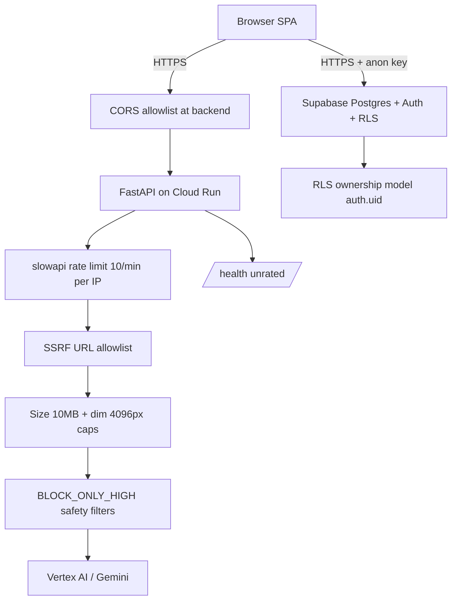
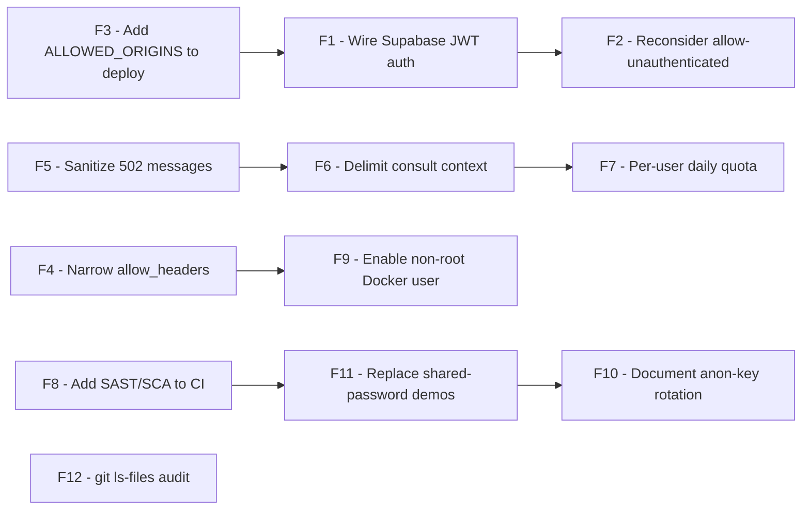

# LOMAR — Security Report

**Project:** LOMAR — Phố Hạnh Phúc Hồ Văn Huê Wedding Ecosystem
**Document type:** Application & Infrastructure Security Report
**Date:** 2026-07-04
**Scope:** Backend API, frontend SPA, Supabase data layer, CI/CD, secrets/config, AI safety, dependencies
**Method:** Static source review against the live repository on `main`, cross-referenced with [`inspection.md`](../inspection.md:1) and [`PROGRESS_management.md`](../PROGRESS_management.md:1)
**Classification:** Internal — for engineering leadership and security reviewers

---

## 1. Executive Summary

LOMAR's security posture has been substantially hardened in the most recent engineering pass. Of the 26 problems flagged in the original [`inspection.md`](../inspection.md:1), the 9 security-relevant items (8, 9, 15, 16, 17, 18, 19, 20, 22) are either resolved or — in one documented case — intentionally bounded by a compensating control. The platform is **safe for a controlled, invite-only beta** today, and is **one documented work-item away from being safe for an uncontrolled public launch**.

| Posture dimension | Rating | Notes |
|---|---|---|
| Backend input validation & DoS limits | ✅ Good | Size, dimension, and rate limits all enforced |
| SSRF / metadata-exfil protection | ✅ Good | Private/loopback/metadata IPs blocked |
| CORS | 🟡 Acceptable | Allowlist in place, but `allow_headers=["*"]` is broad (low risk with `credentials=False`) |
| Backend authentication | 🟡 Partial | Rate limiting is the live control; JWT auth is a documented deferral (Item 16) |
| Supabase Auth & identity | ✅ Good | Real Supabase Auth, UUID identity, no localStorage demo auth |
| Row-Level Security | ✅ Good | Complete ownership model across all user-owned tables |
| AI safety filters | ✅ Good | `BLOCK_ONLY_HIGH` on all generation paths |
| Secrets hygiene | ✅ Good | No keys in client bundle; docs redacted |
| Dependency supply chain | 🟡 Acceptable | Pinned versions; no SAST/SCA automation yet |
| CI/CD | 🟡 Acceptable | Push-to-deploy works; one prod-CORS config gap to close |
| Error handling / info disclosure | 🟡 Minor issues | A few 502 responses leak exception text to clients |

**Headline:** the highest-severity historical risks (open CORS, SSRF, disabled safety filters, sync-blocking I/O, demo auth) are **closed**. The remaining open items are **low-to-medium severity and bounded**, listed in §7.

---

## 2. Scope & Methodology

This report reviews the current source tree of the LOMAR repository at `d:/VKB_Projects/LOMAR/repo` on branch `main`. It covers:

- The FastAPI backend ([`backend/test_api.py`](../backend/test_api.py:1)) and its runtime configuration ([`backend/.env.example`](../backend/.env.example:1), [`backend/Dockerfile`](../backend/Dockerfile:1), [`backend/requirements.txt`](../backend/requirements.txt:1)).
- The React/Vite frontend, focusing on auth and Supabase access ([`src/lib/supabase.ts`](../src/lib/supabase.ts:1), [`src/context/AppContext.tsx`](../src/context/AppContext.tsx:1), [`vite.config.ts`](../vite.config.ts:1)).
- The Supabase Postgres schema and Row-Level Security policies ([`database/migrate_to_v2.sql`](../database/migrate_to_v2.sql:1)).
- CI/CD pipelines ([`.github/workflows/deploy-ui.yml`](../.github/workflows/deploy-ui.yml:1), [`.github/workflows/deploy-backend.yml`](../.github/workflows/deploy-backend.yml:1)).
- AI generation safety and prompt-handling paths in both VTON and `/consult`.

Findings are sourced by reading the actual code (cited with `file:line`), not solely from the audit ledger, so that this report reflects the **current** state rather than the historical inspection snapshot.

---

## 3. Security Architecture

The design relies on **three independent layers of defense**:

1. **Supabase RLS** enforces data ownership at the database (every user-owned row is gated by `auth.uid()`).
2. **FastAPI input guards** (size/dimension/rate/SSRF) protect the AI generation path from abuse and resource exhaustion.
3. **Google safety filters** (`BLOCK_ONLY_HIGH`) bound the generative output surface.

The one layer that is **not yet active** is per-request JWT verification on the backend (Item 16); today the backend trusts the rate limiter as the abuse bound and treats the Supabase anon key as a public credential.

---

## 4. Verified Controls (what is done well)

### 4.1 CORS allowlist

[`backend/test_api.py:37`](../backend/test_api.py:37) parses `ALLOWED_ORIGINS` from env as a comma-separated list and falls back to **localhost-only** defaults when unset — never `["*"]`. The middleware is configured with `allow_credentials=False` ([`test_api.py:66`](../backend/test_api.py:66)), which neutralizes the main risk of credentialed cross-origin abuse. This closes original audit Item 15.

### 4.2 SSRF guard

[`backend/test_api.py:143`](../backend/test_api.py:143) `_is_url_allowed()` rejects:

- non-`http(s)` schemes,
- hostnames that fail DNS resolution,
- **any** resolved IP that is private, loopback, link-local, or reserved,
- the cloud metadata endpoint `169.254.169.254` explicitly, regardless of how the hostname resolves.

It is enforced at the entry of `/proxy-image` ([`test_api.py:395`](../backend/test_api.py:395), returns 403) and `_download_image` ([`test_api.py:186`](../backend/test_api.py:186), returns 403). This closes Item 18 — the most severe finding in the original inspection, since `/proxy-image?url=...` previously allowed arbitrary internal/metadata probing.

### 4.3 Upload & download size/dimension limits

- Uploads are capped at **10 MB** at read time with a 413 ([`test_api.py:215`](../backend/test_api.py:215)).
- Downloads are streamed with a running byte counter and abort with 413 past the cap ([`test_api.py:202`](../backend/test_api.py:202)), so a malicious remote URL cannot exhaust memory.
- Both image dimensions are capped at **4096 px** with a 422 ([`test_api.py:126`](../backend/test_api.py:126)).
- Content-type is validated to start with `image/` before any decode ([`test_api.py:111`](../backend/test_api.py:111), [`test_api.py:120`](../backend/test_api.py:120)).

This closes Item 17.

### 4.4 Rate limiting (compensating control for deferred JWT auth)

slowapi is configured with a `get_remote_address` key function ([`test_api.py:54`](../backend/test_api.py:54)), and `@limiter.limit("10/minute")` is applied to every expensive endpoint: `/proxy-image` ([`test_api.py:392`](../backend/test_api.py:392)), `/test-try-on`, `/test-try-on-upload`, and `/consult` ([`test_api.py:479`](../backend/test_api.py:479)). `/health` is intentionally unrated. This bounds the worst-case Vertex AI cost-exhaustion and DoS surface while JWT auth is pending (Item 16).

### 4.5 Safety filters restored

All four `SafetySetting` thresholds are `BLOCK_ONLY_HIGH` (the least restrictive non-disabled level) on both the VTON path ([`test_api.py:346`](../backend/test_api.py:346)) and the `/consult` path ([`test_api.py:493`](../backend/test_api.py:493)). This replaces the previous `BLOCK_NONE` (fully disabled) posture and closes Item 19. The system prompt for `/consult` ([`test_api.py:87`](../backend/test_api.py:87)) additionally scopes the assistant to wedding topics and instructs it to refuse medical/legal/financial/political questions.

### 4.6 Async I/O (no event-loop blocking)

Sync external calls are wrapped in `await asyncio.to_thread(...)`:

- `requests.get` in `/proxy-image` ([`test_api.py:400`](../backend/test_api.py:400)),
- `_download_image` invoked via `asyncio.to_thread` by its callers,
- `client.models.generate_content` on both VTON ([`test_api.py:355`](../backend/test_api.py:355)) and `/consult` ([`test_api.py:502`](../backend/test_api.py:502)).

This closes Item 20 and prevents a slow Vertex AI call from starving the event loop.

### 4.7 Real Supabase Auth & UUID identity

- Sign-in/up/out use Supabase Auth ([`AppContext.tsx:233`](../src/context/AppContext.tsx:233) `signInWithPassword`, [`AppContext.tsx:244`](../src/context/AppContext.tsx:244) `signUp`, [`AppContext.tsx:258`](../src/context/AppContext.tsx:258) `signOut`).
- Session bootstrap via `getSession()` + `onAuthStateChange` ([`AppContext.tsx:200`](../src/context/AppContext.tsx:200)).
- The app-facing user id is the real `session.user.id` UUID ([`AppContext.tsx`](../src/context/AppContext.tsx:1)); the legacy hardcoded `U01` is gone.
- The Supabase client fails fast in dev when env is missing ([`supabase.ts:10`](../src/lib/supabase.ts:10)).

This closes Items 7, 8, and 9.

### 4.8 Row-Level Security — complete ownership model

[`database/migrate_to_v2.sql:750`](../database/migrate_to_v2.sql:750) "SECTION 6b" defines:

- `profiles.id == auth.uid()` (profile PK is the auth UUID),
- user-owned tables gated by `auth.uid() = user_id`,
- vendor-scoped tables (services, service_images, vouchers) resolved through `vendors.owner_id` via `EXISTS` sub-selects (e.g. [`migrate_to_v2.sql:822`](../database/migrate_to_v2.sql:822)),
- full owner-scoped **INSERT / UPDATE / DELETE** on every user-owned table (not just SELECT),
- public SELECT restricted to active/published content ([`migrate_to_v2.sql:742`](../database/migrate_to_v2.sql:742), [`migrate_to_v2.sql:747`](../database/migrate_to_v2.sql:747)),
- RLS re-asserted idempotently on 20 tables ([`migrate_to_v2.sql:767`](../database/migrate_to_v2.sql:767)–[`migrate_to_v2.sql:787`](../database/migrate_to_v2.sql:787)).

This closes Item 12. The frontend reinforces this with user-scoped queries (e.g. [`FloatingChat.tsx:38`](../src/components/chat/FloatingChat.tsx:38) `.eq('user_id', userId)`), closing Item 22.

### 4.9 Secrets hygiene

- The `define: { 'process.env.GEMINI_API_KEY': ... }` block was removed from [`vite.config.ts`](../vite.config.ts:1) — the client bundle no longer references that key name. Closes Item 6.
- [`README.md:39`](../README/README.md:39) example env uses placeholders, not real Supabase URL/anon key. Closes Item 26.
- The Dockerfile does not bake a `.env` into the image ([`backend/Dockerfile:30`](../backend/Dockerfile:30)); env is supplied at Cloud Run runtime.

### 4.10 Dependency pinning

[`backend/requirements.txt`](../backend/requirements.txt:1) pins all 11 Python dependencies to exact versions (`fastapi==0.115.6`, `google-genai==1.52.0`, `slowapi==0.1.9`, etc.), improving reproducibility and reducing supply-chain drift. The frontend `package.json` uses caret ranges, which is standard for the JS ecosystem but should be paired with a lockfile-committed, CI-pinned resolution (already the case via `package-lock.json` + `npm ci` in [`deploy-ui.yml:47`](../.github/workflows/deploy-ui.yml:47)).

---

## 5. Findings Register

Severity scale: 🔴 High · 🟠 Medium · 🟡 Low · ⚪ Informational

| # | Finding | Severity | Status | Evidence | Remediation |
|---|---|---|---|---|---|
| F1 | Backend has no per-request JWT auth; relies on rate limiting alone | 🟠 Medium | Open (deferred) | [`test_api.py:47`](../backend/test_api.py:47) `ENABLE_AUTH` placeholder | Implement Supabase JWT verification middleware behind `ENABLE_AUTH=true`; require `Authorization: Bearer <jwt>` on `/test-try-on*`, `/proxy-image`, `/consult` |
| F2 | Cloud Run deployed with `--allow-unauthenticated` | 🟠 Medium | Open | [`deploy-backend.yml:57`](../.github/workflows/deploy-backend.yml:57) | After F1 ships, switch to IAM-gated invocation or keep public only while JWT auth is enforced |
| F3 | Prod deploy does not pass `ALLOWED_ORIGINS`, so backend falls back to localhost CORS | 🟠 Medium | Open (config) | [`deploy-backend.yml:59`](../.github/workflows/deploy-backend.yml:59) omits it; fallback at [`test_api.py:41`](../backend/test_api.py:41) | Add `ALLOWED_ORIGINS=https://<user>.github.io` to the `--set-env-vars` list |
| F4 | CORS `allow_headers=["*"]` is broad | 🟡 Low | Open | [`test_api.py:68`](../backend/test_api.py:68) | Restrict to the headers actually used (`Content-Type`, `Accept`); low risk because `allow_credentials=False` |
| F5 | 502 error responses leak exception text to the client | 🟡 Low | Open | [`test_api.py:372`](../backend/test_api.py:372), [`test_api.py:516`](../backend/test_api.py:516) | Log full exception server-side; return a generic message to the client |
| F6 | `/consult` forwards caller-supplied `context` directly into the LLM turn (prompt-injection surface) | 🟡 Low | Open | [`test_api.py:486`](../backend/test_api.py:486) | Sanitize/delimit the context block; the system prompt already scopes the persona, but a malicious `context` could attempt override |
| F7 | `ConsultRequest.message` max 4000 chars, `context` max 8000 chars — combined cost per call bounded, but no per-user daily quota | ⚪ Info | Open | [`test_api.py:83`](../backend/test_api.py:83) | Add a per-user (post-auth) daily generation budget on top of the per-IP 10/min limit |
| F8 | No automated SAST/SCA in CI (no CodeQL, no `npm audit`/`pip-audit` gate) | 🟡 Low | Open | [`.github/workflows/`](../.github/workflows) | Add a security workflow step; pin actions to SHAs |
| F9 | Dockerfile non-root user is commented out | 🟡 Low | Open | [`backend/Dockerfile:33`](../backend/Dockerfile:33) | Cloud Run injects its own identity, but uncommenting the `app` user improves defense-in-depth |
| F10 | Supabase anon key is treated as a public credential (acceptable by design) but there is no documented key-rotation runbook | ⚪ Info | Open | [`supabase.ts:5`](../src/lib/supabase.ts:5) | Document rotation procedure; RLS is the real boundary, not the anon key |
| F11 | Demo sign-in depends on pre-seeded Supabase Auth users with a shared password | 🟡 Low | Open | [`PROGRESS_management.md:179`](../PROGRESS_management.md:179) | Replace shared-password demo accounts with real email-signup or per-reviewer seeded credentials before public launch |
| F12 | `git ls-files` history audit for `dist/`/`node_modules/` not yet run | ⚪ Info | Open | [`PROGRESS_management.md:143`](../PROGRESS_management.md:143) | Run `git ls-files \| Select-String -Pattern '^(dist\|node_modules)/'`; `git rm --cached` any hits |

---

## 6. Open Issues Detail

### 6.1 F1 / F2 — Backend authentication (the one substantive gap)

This is the only finding that materially affects launch readiness. Today the VTON and `/consult` endpoints accept any request, bounded only by slowapi's 10 requests/minute/IP ([`test_api.py:54`](../backend/test_api.py:54)). For an invite-only beta this is acceptable because the audience is trusted and the cost exposure per IP is bounded. For a **public, uncontrolled launch**, an attacker can rotate IPs and drive Vertex AI spend.

The code already has the seam: `ENABLE_AUTH = os.getenv("ENABLE_AUTH", "false")` ([`test_api.py:47`](../backend/test_api.py:47)). The remaining work is to wire a Supabase JWT verification dependency that, when `ENABLE_AUTH=true`, validates the `Authorization: Bearer <jwt>` against the Supabase JWT secret and rejects unauthenticated calls on the four sensitive endpoints. Combined with F2 (switching Cloud Run away from `--allow-unauthenticated`, or keeping it public only because JWT is enforced at the app layer), this fully closes the gap.

### 6.2 F3 — Production CORS misconfiguration

A deployment-time config gap, not a code defect. [`deploy-backend.yml:59`](../.github/workflows/deploy-backend.yml:59) sets Vertex AI env vars but omits `ALLOWED_ORIGINS`. The backend then falls back to `["http://localhost:3000", "http://localhost:5173"]` ([`test_api.py:42`](../backend/test_api.py:42)), which **blocks** the deployed GitHub Pages frontend. This is a one-line fix to the workflow and is the single highest-impact item to close before any real deploy.

### 6.3 F5 — Error-message information disclosure

[`test_api.py:372`](../backend/test_api.py:372) and [`test_api.py:516`](../backend/test_api.py:516) embed `{exc}` in the 502 `detail` returned to the client. This can leak internal hostnames, library versions, or partial stack traces. Low severity because the endpoints are not credentialed, but it should be cleaned up: log the full exception server-side and return a stable, generic message.

### 6.4 F6 — Prompt-injection surface on `/consult`

[`test_api.py:486`](../backend/test_api.py:486) appends the caller-supplied `context` string into the user turn forwarded to the LLM. The system prompt ([`test_api.py:87`](../backend/test_api.py:87)) scopes the persona and instructs refusal of off-topic requests, which is the primary defense. To harden further, the `context` block should be explicitly delimited (e.g. wrapped in markers the system prompt tells the model to treat as untrusted data) and length-capped more tightly than 8000 chars.

---

## 7. Remediation Roadmap

Ordered by impact for a public launch.

| Priority | Item | Effort | Unblocks |
|---|---|---|---|
| P0 | F3 — add `ALLOWED_ORIGINS` to [`deploy-backend.yml:59`](../.github/workflows/deploy-backend.yml:59) | Trivial | Any real frontend↔backend deploy |
| P0 | F1 — implement Supabase JWT verification behind `ENABLE_AUTH=true` | Moderate | Public launch |
| P1 | F2 — decide Cloud Run invocation mode post-JWT | Trivial | Public launch |
| P1 | F5 — sanitize 502 error detail | Trivial | Info-disclosure hygiene |
| P1 | F6 — delimit/truncate `/consult` context | Trivial | Prompt-injection hardening |
| P2 | F7 — per-user daily generation quota | Moderate | Cost control at scale |
| P2 | F8 — add SAST/SCA to CI | Moderate | Supply-chain posture |
| P2 | F4 — narrow `allow_headers` | Trivial | Defense-in-depth |
| P2 | F9 — enable non-root Docker user | Trivial | Container hardening |
| P3 | F11 — replace shared-password demo accounts | Moderate | Real signup path |
| P3 | F10 — document anon-key rotation runbook | Trivial | Operational readiness |
| P3 | F12 — `git ls-files` history audit | Trivial | Repo hygiene |

---

## 8. Threat Model Summary

| Threat | Likelihood | Impact | Current control | Residual risk |
|---|---|---|---|---|
| Attacker drives unbounded Vertex AI spend | Medium | High | slowapi 10/min/IP | Medium until F1/F7 |
| SSRF to cloud metadata / internal services | Low (was High) | Critical | `_is_url_allowed` blocks private/metadata | Low |
| Malicious upload exhausts memory | Low | High | 10 MB + 4096 px caps, streaming download | Low |
| Cross-origin credential theft | Low | Medium | CORS allowlist + `credentials=False` | Low; F4 narrows further |
| Generative unsafe content | Low | Medium | `BLOCK_ONLY_HIGH` + scoped system prompt | Low |
| Cross-user data access via Supabase | Low | High | RLS ownership model + user-scoped queries | Low |
| Prompt injection via `/consult` context | Medium | Low | Scoped system prompt | Low-Medium; F6 hardens |
| Secret leakage in client bundle | Low | High | `define` block removed; docs redacted | Low |
| Info disclosure via error detail | Medium | Low | — | Low; F5 closes |
| Dependency vulnerability | Low-Medium | Medium | Pinned versions, `npm ci` | Medium until F8 adds SCA |

---

## 9. Conclusion

LOMAR's security posture is ** materially stronger than the original inspection implied**. The most dangerous findings — open CORS, SSRF, disabled safety filters, demo localStorage auth, sync-blocking I/O, missing RLS — are **closed in the current code** and verifiable at the cited `file:line` references.

The platform is **safe to run as a gated beta today**. It becomes **safe for a public launch** after closing the P0 items: the one-line `ALLOWED_ORIGINS` deploy fix (F3) and the Supabase JWT auth implementation (F1). Everything else is hardening, hygiene, and operational readiness.

**Recommendation:** treat F1 + F3 as launch blockers, sequence F2/F5/F6 immediately after, and schedule the P2/P3 items as post-launch hardening. There is no architectural rework required — only bounded, documented engineering tasks.

---

## 10. References

- [`inspection.md`](../inspection.md:1) — original 26-item problem list
- [`PROGRESS_management.md`](../PROGRESS_management.md:1) — engineering audit ledger (23/26 resolved)
- [`backend/test_api.py`](../backend/test_api.py:1) — FastAPI backend (security controls live here)
- [`backend/.env.example`](../backend/.env.example:1) — env catalogue
- [`backend/Dockerfile`](../backend/Dockerfile:1) — container build
- [`src/lib/supabase.ts`](../src/lib/supabase.ts:1) — Supabase client init
- [`src/context/AppContext.tsx`](../src/context/AppContext.tsx:1) — auth/session wiring
- [`database/migrate_to_v2.sql`](../database/migrate_to_v2.sql:1) — schema + RLS (SECTION 6b at line 750)
- [`.github/workflows/deploy-backend.yml`](../.github/workflows/deploy-backend.yml:1) — backend CI/CD
- [`.github/workflows/deploy-ui.yml`](../.github/workflows/deploy-ui.yml:1) — frontend CI/CD
- [`vite.config.ts`](../vite.config.ts:1) — client bundle config (secret-define removed)
