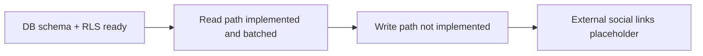
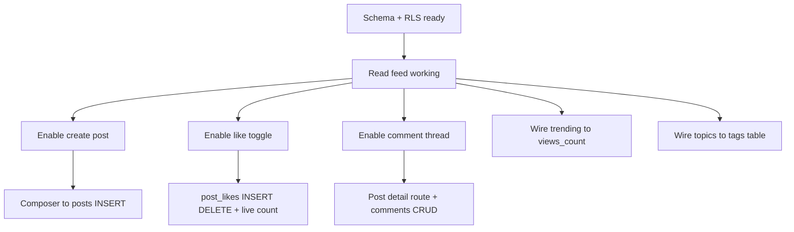

# LOMAR — Social Media Function Progress Report

**Project:** LOMAR — Phố Hạnh Phúc Hồ Văn Huê Wedding Ecosystem
**Document type:** Feature progress report — Social / Community feed
**Date:** 2026-07-07
**Scope:** The in-app social/community feed (Blog) and the external social presence links
**Primary sources:** [`src/pages/Blog.tsx`](../../../src/pages/Blog.tsx:1), [`SPEC.md`](../../../SPEC.md:391), [`database/DATA_Schema.md`](../../../database/DATA_Schema.md:216), [`database/migrate_to_v2.sql`](../../../database/migrate_to_v2.sql:999), [`src/components/layout/Footer.tsx`](../../../src/components/layout/Footer.tsx:52)

---

## 1. Executive summary

The social media function is a **read-only community feed** exposed at the `/blog` route. It renders real, published posts from Supabase along with their author, like counts, comment counts, and tags. The data layer, schema, and read path are production-grade — the Blog list query was refactored from an N+1 pattern into six batched queries, and all database access is now fully typed. The **write path is not implemented**: users cannot create posts, like, comment, or share from the UI. Those controls are present but display-only. The external social links in the site footer (Facebook, TikTok) are placeholder anchors.

| Dimension | Status |
|---|---|
| Database schema (posts, comments, likes, tags) | Complete |
| Row-Level Security policies | Complete for read and owner CRUD |
| Feed read path (list, author, counts, tags) | Complete and performance-optimized |
| Type safety on DB access | Complete |
| Post composer (create post) | Not implemented |
| Like / comment / share interactions | Not implemented (display-only) |
| Trending posts / topics widgets | Static placeholder data |
| External social profile links | Placeholder anchors |

---

## 2. What is implemented

### 2.1 Data model

The social feature is backed by five tables, defined in the v2 schema and migration:

| Table | Purpose | Reference |
|---|---|---|
| `posts` | Community posts (title, content, cover image, view count, status) | [`DATA_Schema.md:216`](../../../database/DATA_Schema.md:216) |
| `post_comments` | Comments with nested-reply support (`parent_comment_id`) and moderation `status` | [`DATA_Schema.md:236`](../../../database/DATA_Schema.md:236) |
| `post_likes` | Composite-key like records | [`DATA_Schema.md:255`](../../../database/DATA_Schema.md:255) |
| `tags` | Tag dictionary with `slug` | [`DATA_Schema.md:267`](../../../database/DATA_Schema.md:267) |
| `post_tags` | Post-to-tag junction | [`DATA_Schema.md:281`](../../../database/DATA_Schema.md:281) |

`posts.status` is constrained to `draft` / `published` / `hidden`, and `post_comments.status` to `published` / `hidden` / `flagged`, so a moderation workflow is expressible at the data layer even though no UI drives it yet.

### 2.2 Row-Level Security

RLS is fully specified for the social tables in [`database/migrate_to_v2.sql`](../../../database/migrate_to_v2.sql:999):

- **Posts** — public `SELECT` of `status = 'published'`; authors can `SELECT` / `INSERT` / `UPDATE` / `DELETE` their own rows ([`migrate_to_v2.sql:1003`](../../../database/migrate_to_v2.sql:1003)).
- **Comments** — public `SELECT` of published comments; owner CRUD ([`migrate_to_v2.sql:1019`](../../../database/migrate_to_v2.sql:1019)).
- **Likes** — public `SELECT` (for counts); owner `INSERT` / `DELETE` ([`migrate_to_v2.sql:1038`](../../../database/migrate_to_v2.sql:1038)).
- **Post tags** — readable when the parent post is published; managed by the post author ([`migrate_to_v2.sql:1058`](../../../database/migrate_to_v2.sql:1058)).

A `post-images` storage bucket is provisioned for post cover images ([`DATA_Schema.md:527`](../../../database/DATA_Schema.md:527)).

The security boundary for the write path is therefore **already in place** — enabling create/like/comment is a frontend integration task, not a policy-design task.

### 2.3 Feed read path (Blog page)

[`src/pages/Blog.tsx`](../../../src/pages/Blog.tsx:26) implements the feed:

- Loads posts newest-first from `posts` ([`Blog.tsx:34`](../../../src/pages/Blog.tsx:34)).
- Resolves author name and avatar from `profiles` ([`Blog.tsx:128`](../../../src/pages/Blog.tsx:128)), falling back to `Anonymous` and a default avatar.
- Aggregates like counts from `post_likes` in memory ([`Blog.tsx:67`](../../../src/pages/Blog.tsx:67)).
- Aggregates comment counts from `post_comments` in memory ([`Blog.tsx:81`](../../../src/pages/Blog.tsx:81)).
- Resolves tags through `post_tags` → `tags` ([`Blog.tsx:94`](../../../src/pages/Blog.tsx:94)).
- Formats relative time in `giờ` / `ngày` ([`Blog.tsx:141`](../../../src/pages/Blog.tsx:141)).
- Shows a loading spinner and gracefully renders an empty feed on error or no data ([`Blog.tsx:39`](../../../src/pages/Blog.tsx:39), [`Blog.tsx:157`](../../../src/pages/Blog.tsx:157)).

**Performance.** The prior implementation issued per-post reads (roughly 5N+1 queries). It was replaced with **six batched queries total** — posts, profiles (`.in('id', userIds)`), likes, comments, post_tags, and tags — with counts and tag names resolved via in-memory `Map`s ([`Blog.tsx:44`](../../../src/pages/Blog.tsx:44)). This is recorded as resolved audit Item 21.

**Type safety.** All reads use generated row aliases from [`src/types/database.ts`](../../../src/types/database.ts:1) (`PostRow`, `ProfileRow`, `PostLikeRow`, `PostCommentRow`, `PostTagRow`, `TagRow`) with no `as any` DB casts ([`Blog.tsx:18`](../../../src/pages/Blog.tsx:18)). `npx tsc --noEmit` is clean.

---

## 3. What is not implemented

These are display-only or placeholder elements in the current UI:

- **Post composer** — the "Bạn đang nghĩ gì?" input and its image/GIF/emoji buttons do not create posts ([`Blog.tsx:198`](../../../src/pages/Blog.tsx:198)). No `INSERT` into `posts` is wired.
- **Like / comment / share buttons** — rendered per post but have no click handlers; `shares` is hard-coded to `0` ([`Blog.tsx:151`](../../../src/pages/Blog.tsx:151), [`Blog.tsx:240`](../../../src/pages/Blog.tsx:240)).
- **Sort / filter controls** — the left-rail sort menu ("Mới Nhất", "Phổ Biến", "Danh Mục"…) and the feed tabs ("Dành cho bạn", "Đang theo dõi"…) are static; only newest-first ordering is actually applied ([`Blog.tsx:172`](../../../src/pages/Blog.tsx:172), [`Blog.tsx:211`](../../../src/pages/Blog.tsx:211)).
- **Trending posts & topics widgets** — the "TOP BÀI VIẾT THỊNH HÀNH" and "CHỦ ĐỀ ĐƯỢC QUAN TÂM" panels use hard-coded arrays, not `views_count` or `tags` data ([`Blog.tsx:258`](../../../src/pages/Blog.tsx:258), [`Blog.tsx:276`](../../../src/pages/Blog.tsx:276)).
- **Post search** — the right-rail search box has no query behavior ([`Blog.tsx:251`](../../../src/pages/Blog.tsx:251)).
- **Post detail / comment thread view** — there is no route to open a single post or read/write its comment thread; `parent_comment_id` nesting is unused by the UI.
- **View counting** — `posts.views_count` exists in schema but is never incremented from the app.

This matches the limitations already documented in [`SPEC.md:405`](../../../SPEC.md:405).

### 3.1 External social presence

The footer renders **Facebook** and **TikTok** icons, but both point to `href="#"` placeholders rather than real profiles ([`Footer.tsx:52`](../../../src/components/layout/Footer.tsx:52)). There is no share-to-social integration (e.g., sharing a generated VTON preview to social), despite that being called out as the intended viral hook in the go-to-market plan ([`Proposal.md:208`](../../../docs/Proposal.md:208)).

---

## 4. Gap analysis

The backend readiness (schema, RLS, storage bucket, typed client) is well ahead of the frontend interaction layer. The remaining work is almost entirely **frontend wiring against policies that already exist**:

| Gap | Enabling piece already present | Remaining work |
|---|---|---|
| Create post | `posts` INSERT policy, `post-images` bucket | Composer submit → typed `INSERT`; optional image upload |
| Like toggle | `post_likes` INSERT/DELETE policy | Button handler + optimistic count update |
| Comment thread | `post_comments` CRUD policy, nesting column | Post-detail route + comment list/compose |
| Trending widget | `posts.views_count` column | Increment on view + query top-by-views |
| Topics widget | `tags` / `post_tags` tables | Query real tags; filter feed by tag |
| Share | — | Define share target (link, or social/VTON share) |
| External links | Footer icons | Replace `#` with real profile URLs |

---

## 5. Recommended next steps

Ordered by leverage, given the read path and policies are already done:

1. **Wire the like toggle** — smallest end-to-end write; validates the authenticated write path against `post_likes` RLS with an optimistic UI update.
2. **Wire the post composer** — typed `INSERT` into `posts` (author = `auth.uid()`), with optional cover upload to the `post-images` bucket; refresh the feed on success.
3. **Add a post-detail route with comments** — read the comment thread (using `parent_comment_id` for replies) and allow authenticated create.
4. **Replace static widgets with real data** — drive "trending" from `views_count` (add a view increment) and "topics" from the `tags` table; make topic chips filter the feed.
5. **Add sort/filter behavior** — connect the existing sort menu and tabs to query ordering (newest / popular).
6. **Finish external social presence** — set real Facebook/TikTok profile URLs in the footer and decide whether VTON previews get a share-to-social action to support the launch plan.

None of these require schema or RLS changes; they are frontend integration tasks on top of the current foundation.

---

## 6. Verification basis

- Feed behavior and limitations read directly from [`src/pages/Blog.tsx`](../../../src/pages/Blog.tsx:1) and cross-checked against [`SPEC.md:391`](../../../SPEC.md:391).
- Schema confirmed in [`database/DATA_Schema.md`](../../../database/DATA_Schema.md:216); RLS confirmed in [`database/migrate_to_v2.sql`](../../../database/migrate_to_v2.sql:999).
- N+1 elimination and type-safety status corroborated by the prior progress ledger ([`archive/5_7_26_Progress.md:53`](../../progress/archive/5_7_26_Progress.md:53)).
- External social links read from [`src/components/layout/Footer.tsx:52`](../../../src/components/layout/Footer.tsx:52).
